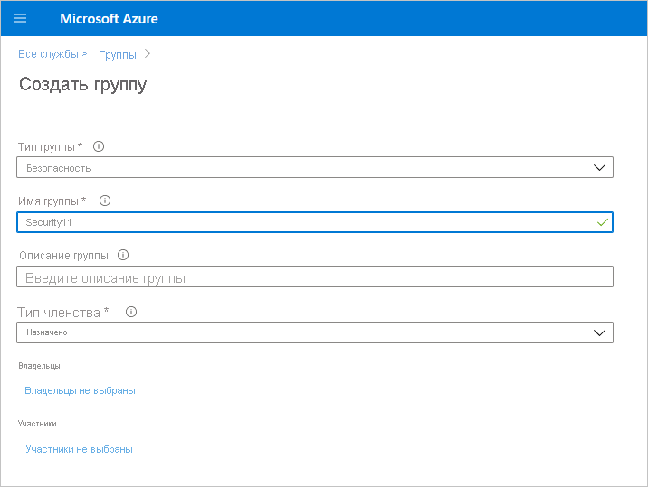

# Включение аутентификации субъекта-службы для интерфейсов API администрирования с доступом только на чтение (предварительная версия)

Субъект-служба — это метод проверки подлинности, который можно использовать, чтобы предоставить приложению Azure Active Directory (Azure AD) доступ к содержимому службы и API-интерфейсам Power BI.
При создании приложения Azure AD создается [объект субъекта-службы](https://docs.microsoft.com/azure/active-directory/develop/app-objects-and-service-principals#service-principal-object). Субъект-служба позволяет Azure AD проверить подлинность приложения. После проверки подлинности приложение может получить доступ к ресурсам клиента Azure AD.

## Метод

Чтобы включить проверку подлинности субъекта-службы для API только для чтения в Power BI, выполните следующие действия:

1. [Создайте приложение Azure AD](https://docs.microsoft.com/azure/active-directory/develop/howto-create-service-principal-portal). Если у вас уже есть подходящее приложение Azure AD, этот шаг можно пропустить. Запишите идентификатор приложения на будущее. 
2. Создайте новую **группу безопасности** в Azure Active Directory. [Узнайте больше о создании базовой группы и добавлении участников с помощью Azure Active Directory](https://docs.microsoft.com/azure/active-directory/fundamentals/active-directory-groups-create-azure-portal). Этот шаг можно пропустить, если у вас уже есть подходящая группа безопасности.
    Убедитесь, что выбран параметр **Безопасность** в качестве типа группы.

    

3. Добавьте идентификатор приложения в качестве участника созданной группы безопасности. Для этого сделайте следующее:
    1. Перейдите в раздел **портал Azure > Azure Active Directory > Группы** и выберите группу безопасности, созданную на шаге 2.
    1. Выберите **Добавить участников**.
    Примечание. Убедитесь, что для используемого приложения на портале Azure не установлены роли администратора Power BI. Чтобы проверить это: 
       * Войдите на **портал Azure** в качестве глобального администратора, администратора приложений или администратора облачных приложений. 
        * Выберите **Azure Active Directory** > **Корпоративные приложения**. 
        * Выберите приложение, доступ к которому требуется предоставить Power BI. 
        * Нажмите кнопку **Разрешения**. Убедитесь, что для этого приложения не заданы разрешения, требующие согласия администратора Power BI. Дополнительные сведения см. в статьях [Управление согласием для приложений и оценка запросов на согласие](https://docs.microsoft.com/azure/active-directory/manage-apps/manage-consent-requests). 
4. Включите параметры администрирования службы Power BI. Выполните указанные ниже действия.
    1. Войдите на портале администрирования Power BI. Для просмотра страницы параметров клиента необходимо быть администратором Power BI.
    1. В разделе **Параметры API администрирования** вы увидите пункт **Разрешить субъектам-службам использовать API администрирования с доступом только на чтение в Power BI (предварительная версия)** . Установите переключатель в положение "Включено", а затем выберите **Определенные группы безопасности** и добавьте группу безопасности, созданную на шаге 2, в текстовое поле ниже, как показано на рисунке.

        

 5. Начните использовать API администрирования с доступом только на чтение. Список поддерживаемых API см. ниже.

    >[!IMPORTANT]
    >После активации субъекта-службы для использования с Power BI разрешения приложения в Azure AD перестают действовать. В дальнейшем управление разрешениями приложения осуществляется на портале администрирования Power BI.

## Рекомендации и ограничения
* С помощью субъекта-службы нельзя входить на портал Power BI.
* Для включения субъекта-службы в параметрах API администрирования на портале администрирования Power BI требуются права администратора Power BI.
* Субъект-служба в настоящее время поддерживает следующие API:
    * [GetGroupsAsAdmin](https://docs.microsoft.com/rest/api/power-bi/admin/groups_getgroupsasadmin) с $expand для панелей мониторинга, наборов данных, отчетов и потоков данных 
    * [GetDashboardsAsAdmin](https://docs.microsoft.com/rest/api/power-bi/admin/dashboards_getdashboardsasadmin) с элементами $expand
    * [GetDatasourcesAsAdmin](https://docs.microsoft.com/rest/api/power-bi/admin/datasets_getdatasourcesasadmin) 
    * [GetDatasetToDataflowsLinksAsAdmin](https://docs.microsoft.com/rest/api/power-bi/admin/datasets_getdatasettodataflowslinksingroupasadmin)
    * [GetDataflowDatasourcesAsAdmin](https://docs.microsoft.com/rest/api/power-bi/admin/dataflows_getdataflowdatasourcesasadmin) 
    * [GetDataflowUpstreamDataflowsAsAdmin](https://docs.microsoft.com/rest/api/power-bi/admin/dataflows_getupstreamdataflowsingroupasadmin) 
    * [GetCapacitiesAsAdmin](https://docs.microsoft.com/rest/api/power-bi/admin/getcapacitiesasadmin)
    * [GetActivityLog](https://docs.microsoft.com/rest/api/power-bi/admin/getactivityevents)
    * [GetModifiedWorkspaces](https://docs.microsoft.com/rest/api/power-bi/admin/workspaceinfo_getmodifiedworkspaces)
    * [WorkspaceGetInfo](https://docs.microsoft.com/rest/api/power-bi/admin/workspaceinfo_postworkspaceinfo)
    * [WorkspaceScanStatus](https://docs.microsoft.com/rest/api/power-bi/admin/workspaceinfo_getscanstatus)
    * [WorkspaceScanResult](https://docs.microsoft.com/rest/api/power-bi/admin/workspaceinfo_getscanresult)
