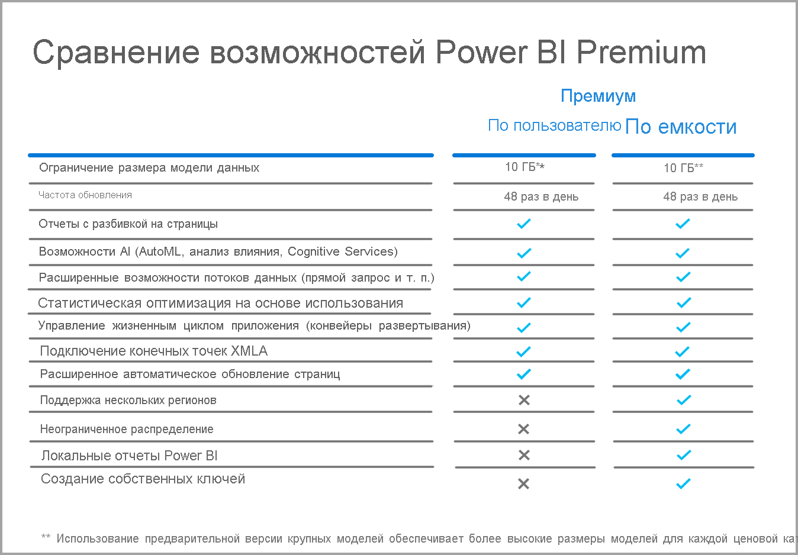

# Вопросы и ответы по Power BI Premium на пользователя (предварительная версия)

Power BI **Premium на пользователя** позволяет организациям лицензировать функции уровня Premium отдельно для каждого пользователя. Premium на пользователя (PPU) включает все возможности лицензий Power BI Pro, а также добавляет такие функции, как отчеты с разбивкой на страницы, ИИ и другие возможности, доступные только для подписчиков уровня Premium. 

В этой статье содержатся ответы на часто задаваемые вопросы о лицензировании Premium на пользователя. Вся информация в этой статье может измениться, когда Premium на пользователя перейдет со стадии предварительной версии на стадию общей доступности (GA). 

В этой статье содержатся вопросы и ответы по следующим категориям:
* Общие вопросы 
* Вопросы по администрированию 
* Вопросы по взаимодействию с конечным пользователем 

## Общие вопросы

1.  **Что такое Power BI Premium на пользователя (PPU)?** 

    Premium на пользователя (PPU) — это новый способ лицензирования функций уровня Premium отдельно для каждого пользователя. Эта лицензия включает все возможности Power BI Pro, а также такие функции, как отчеты с разбивкой на страницы, ИИ и другие возможности, доступные только в версии Premium.

2.  **Когда лицензия будет доступна для приобретения?**

    Разработка продолжается, выпуск общедоступной версии ожидается не ранее 2021 года. До этого момента любая организация может бесплатно использовать общедоступную предварительную версию.

3.  **Требуется ли использовать две лицензии — Power BI Pro и Premium на пользователя?**

    Нет, все возможности Power BI Pro вы получаете с лицензией Premium на пользователя.

4.  **Как получить пробную версию?**

    Пробная версия доступна в самом продукте и в Microsoft 365. Любой пользователь, если организация не ограничила PPU, может получить доступ к пробной версии продукта, включив Premium на пользователя в рабочей области. Пробную версию в Microsoft 365 можно включить на портале так же, как пробные версии Power BI Pro.  

5.  **Какие функции доступны в лицензии Premium на пользователя?**

    Таблица сравнения функций:    

    

6.  **В моей организации уже есть Power BI Premium. Нужна ли мне лицензия Premium на пользователя для публикации содержимого в моей емкости?**
    
    Ваша организация может дополнить свою емкость Premium лицензиями Premium на пользователя, но лицензия Premium на пользователя не требуется для публикации содержимого в существующих емкостях.  

## Административные вопросы

1.  **Как включить Premium на пользователя (PPU) для моего клиента?**
    
    После подготовки лицензии для PPU для клиента функции PPU будут доступны в любой рабочей области, для которой вы их включаете. В предварительной версии просто включите функции Premium на пользователя в раскрывающемся списке емкости, выбрав элемент Premium на пользователя, как показано на следующем рисунке.

    

2.  **Работает ли эта лицензия как емкость Premium? Можно ли включать или выключать функции?**

    Нет, в PPU нельзя управлять памятью или ЦП. В этом отношении лицензия работает так же, как Power BI Pro. Администратор клиента может управлять некоторыми параметрами функций, но не может отключить рабочие нагрузки, такие как отчеты с разбивкой на страницы, так же, как вы сейчас не можете отключить панели мониторинга. 

3.  **Где можно управлять параметрами лицензии Premium на пользователя?**

    Новый параметр меню в параметрах клиента для Premium на пользователя позволяет администраторам управлять этими параметрами.

4.  **Можно ли указать, какие пользователи могут создавать рабочие области PPU?**

    Да, точно так же, как вы можете указать, какие пользователи могут создавать рабочие области.

5.  **Могут ли администраторы клиентов видеть, какие рабочие области помечены как Premium на пользователя?**

    Да, они указаны в пункте меню "Рабочие области" на экране администратор клиента, где отображаются рабочие области, помеченные как Premium.

6.  **Можно ли перемещать рабочие области между уровнями Premium на пользователя и Premium?**

    Да. Для общедоступной версии вам потребуется выполнить полное обновление всех наборов или потоков данных, которые находятся в рабочей области, после переноса в емкость Premium. Это требование помешает компаниям обойти схему оплаты за ЦП в Premium 2-го поколения.

7.  **Доступны ли API емкости для Premium на пользователя?**

    Доступен ограниченный набор API для перемещения между рабочими областями, но вы не можете отключать рабочие нагрузки или выполнять другие подобные действия.  

## Вопросы по взаимодействию с конечным пользователем

1.  **Если я пометил рабочую область как Premium на пользователя, как другие пользователи узнают об этом?**
    
    Рабочие области Premium на пользователя будут помечены новым значком, как показано на следующем изображении:

        

2.  **Кто может получить доступ к содержимому рабочей области или приложения Premium на пользователя?**

    Любой пользователь должен иметь лицензию Premium на пользователя для просмотра содержимого в рабочей области Premium на пользователя. Сюда входят сценарии, в которых пользователи обращаются к содержимому через конечную точку XMLA, анализа в Excel, составных моделей и т. д. Вы можете предоставить доступ к рабочей области пользователям, у которых еще нет лицензии PPU, но они получат сообщение о том, что не могут получить доступ к содержимому. Если они отвечают критериям, им предложат пробную лицензию. Если они не отвечают критериям, администратор клиента должен назначить им лицензию.

3.  **Какое содержимое доступно с разными видами лицензий?**

    На следующей диаграмме показано, какое содержимое доступно с PPU:

       

4.  **Можно ли использовать Premium на пользователя для встроенного содержимого?**

    Уровень Premium на пользователя подходит для встроенного содержимого так же, как лицензия Pro. Вы можете внедрять содержимое, и каждому пользователю потребуется лицензия PPU для его просмотра.

5.  **Что произойдет с моей рабочей областью PPU, когда срок действия пробной версии истечет?**

    Пользователи по-прежнему будут иметь доступ к рабочей области, однако содержимое, для которого требуется этот тип лицензии, будет недоступно. Необходимо либо переместить рабочую область в емкость Premium, либо просто отключить это требование. 
6.  **Какой общий объем хранилища дает лицензия Premium на пользователя?**

    Весь клиент будет иметь то же ограничение в 100 ТБ, что и емкость Premium.

7.  **Будет ли API экспорта доступен для Premium на пользователя?**

    В настоящее время эта возможность доступна для отчетов с разбивкой на страницы и может использоваться только один раз в 5 минут.  Отчеты Power BI пока не поддерживаются.  

8.  **Как будут работать подписки по электронной почте в PPU?**

    Любой пользователь с лицензией PPU или Pro может получить подписку и все ее вложения, если вложение одинаково для всех пользователей. Пользователи Pro не смогут просматривать содержимое на портале продукта. Если появятся дополнительные возможности подписки, которые позволяют использовать различные представления данных для разных получателей, для использования этих возможностей потребуется лицензия PPU (или емкость Premium).

9.  **Можно ли превысить ограничение в 48 обновлений через портал при использовании API обновления?**

    В данный момент обновления не ограничиваются.  

10. **Можно ли использовать приложение Power BI Premium Capacity Metrics для мониторинга использования Premium на пользователя?**

    Приложение Power BI Premium Capacity Metrics не работает с Premium 2-го поколения, поэтому не позволяет просматривать элементы PPU.  

11. **Можно ли разместить набор данных Power BI в рабочей области PPU, создать отчет по нему, опубликовать в рабочей области не по лицензии PPU и предоставить пользователям доступ к этому отчету без лицензии PPU?**

    Нет. Поскольку набор данных находится в рабочей области Premium на пользователя, он не будет доступен для просмотра пользователям без лицензии, даже если они могут получить доступ к отчету в рабочей области без PPU.

12. **Можно ли одновременно обновить несколько моделей данных объемом 10 ГБ?**

    Действуют те же ограничения, которые применяются для параллельного обновления в Premium 2-го поколения.

13. **Можно ли предоставлять общий доступ к содержимому, размещенному в Premium на пользователя, с помощью публикации в Интернете?**

    Функция публикации в Интернете работает так же, как для содержимого в емкости Premium.

14. **Можно ли запустить поток данных в рабочей области Premium на пользователя и импортировать его в набор данных Power BI в другой рабочей области, чтобы пользователям, которые используют это содержимое, не нужна была лицензия Premium на пользователя?**

    Если у автора отчета Power BI есть лицензия Premium на пользователя, это возможно в период действия предварительной версии PPU.

15. **Можно ли использовать мобильные приложения Power BI с Premium на пользователя?**

    Да. Мобильные приложения Power BI были обновлены для работы с любым содержимым, опубликованным в приложении или рабочей области Premium на пользователя.

**Дальнейшие действия**

* [Что такое Power BI Premium?](service-premium-what-is.md)
* [Технический документ по Microsoft Power BI Premium](https://aka.ms/pbipremiumwhitepaper)
* [Технический документ по планированию развертывания Power BI Enterprise](https://aka.ms/pbienterprisedeploy)
* [Активация расширенной пробной версии Power BI Pro](../fundamentals/service-self-service-signup-for-power-bi.md)
* [Часто задаваемые вопросы о Power BI Embedded](../developer/embedded/embedded-faq.md)

Появились дополнительные вопросы? [Попробуйте задать вопрос в сообществе Power BI.](https://community.powerbi.com/)
