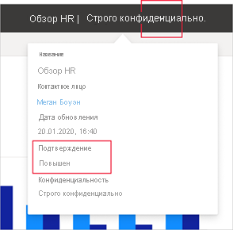

# Подтверждение — повышение уровня и сертификация содержимого Power BI

## Общие сведения о подтверждении

У организаций часто накапливаются большие объемы содержимого Power BI, доступного для обмена и повторного использования пользователями Power BI, и довольно сложно бывает найти надежное и заслуживающее доверия содержимое. Подтверждение — это способ упростить пользователям поиск качественного содержимого. Подтвержденное содержимое четко отмечено как в Power BI, так и в других местах, где пользователи ищут содержимое Power BI (например, Excel). Оно также имеет приоритет при некоторых операциях поиска, и его можно сортировать в некоторых списках.

Существует два типа подтверждения: **повышение уровня** и **сертификация**.

* **Повышение уровня**. Повышение уровня позволяет пользователям выделять содержимое, которое они считают полезным и надежным для других пользователей. Это способствует совместному распространению содержимого в организации.

    Любой владелец содержимого или любой участник с разрешениями на запись в рабочей области, где находится содержимое, может просто повысить уровень содержимого, если он считает, что им стоит поделиться.

* **Сертификация**. Сертификация означает, что содержимое соответствует стандартам качества организации и может рассматриваться как надежное и заслуживающее доверие, а также готовое к использованию в организации.

    Только избранная группа рецензентов, назначенных администратором Power BI, может сертифицировать содержимое. Владельцы содержимого, которые хотят сертифицировать свое содержимое, но не имеют полномочий сделать это сами, должны следовать инструкциям организации по сертификации содержимого.

    **Сертификация доступна только в том случае, если администратор Power BI включил и настроил ее для вашей организации**.

На рисунке ниже показано, каким образом подтвержденное содержимое (с повышением уровня и сертификацией) помечено при поиске набора данных для создания отчета.

## Типы содержимого, которое можно подтвердить
Power BI в настоящее время поддерживает подтверждение для следующих типов содержимого:
* Наборы данных
* Потоки данных (предварительная версия)
* Отчеты (предварительная версия)
* Приложения (предварительная версия)

## Поиск подтвержденного содержимого

Подтвержденное содержимое помечено эмблемами и значками в списках, карточках и других местах, как в Power BI, так и в других инструментах, например Excel, где можно найти содержимое Power BI. Следующие эмблемы и значки обозначают подтвержденное содержимое.

|Значок|Значок|
|---------|---------|
|||
|||
|||

Кроме того, если вы используете отчет или приложение, состояние подтверждения можно просмотреть в заголовке.
* Сертификация указывается как в заголовке, так и в раскрывающемся списке заголовка, где можно также узнать, кто сертифицировал содержимое.

    

* Повышение уровня указывается только в раскрывающемся списке заголовка.
 
    

## Принятие решений о необходимости подтверждения приложения или отчета

Подтверждение предназначено для содержимого (приложений, отчетов, наборов данных и потоков), чтобы пользователям было проще находить и использовать его и, возможно, делиться им с другими.

При публикации данных для широкой аудитории Power BI рекомендует использовать приложение. Если соблюдать эту рекомендацию, нужно сделать так, чтобы пользователи могли легко найти это приложение. В таких случаях следует подтвердить приложение. 

Если вы все же предпочитаете делиться отчетами напрямую, подтвердите сам отчет. 

Даже если вы не планируете повторно делиться отчетом или приложением, если лежащие в его основе наборы данных готовы для повторного использования, поддержите эти наборы данных. То же относится и к потокам данных.  

## Дальнейшие действия

* [Повышение уровня или сертификация содержимого Power BI](service-endorse-content.md)
* [Включение сертификации для организации](../admin/service-admin-setup-certification.md) (администраторы Power BI)
* У вас появились вопросы? [Попробуйте задать вопрос в сообществе Power BI.](https://community.powerbi.com/)