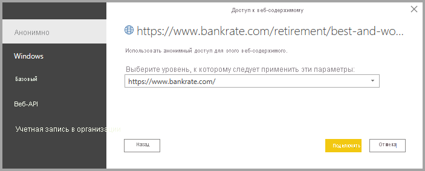

# Подключение к веб-странице из Power BI Desktop

Вы можете подключиться к веб-странице и импортировать информацию с нее в приложение Power BI Desktop, а затем использовать ее в визуальных элементах и моделях данных.

В Power BI Desktop выберите **Получение данных > Интернет** на ленте **Главная**.

Откроется диалоговое окно для ввода URL-адреса веб-страницы, с которой нужно импортировать данные.

Введите или вставьте URL-адрес и нажмите кнопку **ОК**. Power BI Desktop предложит указать способ доступа к веб-содержимому.

Power BI Desktop подключится к этой веб-странице и выведет содержащиеся на ней данные в окне **навигатора**. Если вы выберете один из доступных на ней элементов (например, таблицу или всю страницу), в правой части окна **навигатора** появятся в режиме предварительного просмотра соответствующие данные.

Вы можете нажать кнопку **Преобразовать данные**, чтобы запустить **редактор запросов**, позволяющий отформатировать и преобразовать данные с веб-страницы, прежде чем импортировать их в Power BI Desktop. Если нажать кнопку **Загрузить**, все элементы данных, выбранные в левой области, будут импортированы в приложение.

При нажатии кнопки **Load** Power BI Desktop импортирует выбранные элементы и добавляет их в область **Поля** в правой части представления отчетов в Power BI Desktop.

На этом процедура подключения к веб-странице и переноса данных с нее в Power BI Desktop завершена.

После этого вы сможете перетаскивать поля на холст ответа и создавать элементы визуализации. Вы также можете использовать данные на веб-странице, как и любые другие сведения: менять их формат, создавать связи между ними и другими источниками модели, а также выполнять любые другие действия для создания отчетов Power BI.

Более подробно подключение к веб-страницам рассматривается в [руководстве по началу работы с Power BI Desktop](../fundamentals/desktop-getting-started.md).

## Проверка отзыва сертификата

Power BI применяет безопасность для веб-подключений, чтобы защитить данные. В некоторых сценариях, например при записи веб-запросов с помощью Fiddler, веб-подключения могут работать неправильно. Чтобы работать с такими сценариями, снимите флажок **Включить проверку отзыва сертификатов** в Power BI Desktop, а затем перезапустите Power BI Desktop. 

Чтобы изменить этот параметр, выберите **Файл > Параметры**, а затем на левой панели выберите **Безопасность**. Этот флажок показан на следующем рисунке. Если снять флажок, веб-подключения будут менее безопасными. 

## Дальнейшие действия
В Power BI Desktop можно подключаться к данным самых разных видов. Дополнительные сведения об источниках данных см. в перечисленных ниже статьях.

* [Источники данных в Power BI Desktop](desktop-data-sources.md)
* [Формирование и объединение данных в Power BI Desktop](desktop-shape-and-combine-data.md)
* [Подключение к данным Excel в Power BI Desktop](desktop-connect-excel.md)   
* [Подключение к CSV-файлам в Power BI Desktop](desktop-connect-csv.md)   
* [Ввод данных непосредственно в Power BI Desktop](desktop-enter-data-directly-into-desktop.md)   
