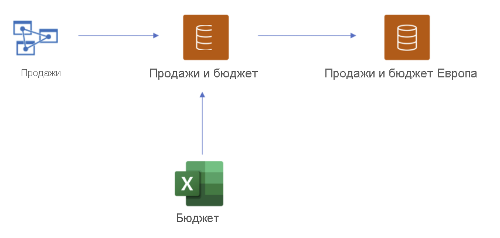

# Использование DirectQuery для наборов данных Power BI и Azure Analysis Services (предварительная версия)

**Наборы данных DirectQuery для Power BI и Azure Analysis Services (AAS)** позволяют использовать DirectQuery для подключения к AAS или наборам данных Power BI и при необходимости объединять их с другими данными DirectQuery и импортированными сведениями. Эта функция особенно полезна для авторов отчетов, желающих объединить данные из своей корпоративной семантической модели с другими собственными данными, например с электронной таблицей Excel, либо персонализировать или обогатить метаданные этой модели.

## Включение предварительной версии функции

Так как на данный момент доступна только предварительная версия этой функции, ее сначала необходимо включить. Для этого в Power BI Desktop последовательно выберите **Файл > Параметры и настройки > Параметры** и в разделе **Функции предварительной версии** установите флажок **DirectQuery for Power BI DataSets and Analysis Services** (DirectQuery для наборов данных Power BI и Analysis Services), чтобы включить эту предварительную версию функции. Чтобы изменения вступили в силу, возможно, потребуется перезапустить Power BI Desktop.

## Использование DirectQuery для динамических подключений

Чтобы использовать DirectQuery для наборов данных Power BI и Azure Analysis Services, у отчета должна быть локальная модель. Можно начать с динамического подключения, а затем добавить к нему локальную модель или перейти на ее использование. Другой вариант — начать с создания подключения DirectQuery или импорта данных. В этом случае локальная модель будет создана в отчете автоматически.

Сведения о том, какие подключения используются в модели, приведены в строке состояния в правом нижнем углу Power BI Desktop. Если установлено подключение только к источнику Azure Analysis Services, будет отображаться сообщение, аналогичное следующему.

Если установлено подключение к набору данных Power BI, будет отображаться сообщение со сведениями об этом наборе.

Если необходимо настроить метаданные полей в динамически подключенном наборе данных, в строке состояния выберите **Make changes to this model** (Внести изменения в эту модель). Кроме того, можно нажать кнопку **Make changes to this model** (Внести изменения в эту модель) на ленте, как показано на следующем рисунке. **Представление отчетов** с кнопкой **Make changes to this model** (Внесите изменения в эту модель) на вкладке **Моделирование**. В представлении модели кнопка находится на вкладке **Главная**.

При нажатии кнопки отображается диалоговое окно с подтверждением добавления локальной модели. Выберите **Add a local model** (Добавить локальную модель), чтобы включить создание новых столбцов или изменение метаданных для полей из наборов данных Power BI или Azure Analysis Services. Отображаемое диалоговое окно показано на следующем рисунке. 

При динамическом подключении к источнику Analysis Services локальная модель отсутствует. Чтобы использовать DirectQuery для динамически подключенных источников, таких как наборы данных Power BI и Azure Analysis Services, необходимо добавить в отчет локальную модель. При публикации отчета с локальной моделью в служба Power BI также публикуется набор данных для этой локальной модели.

## Построение цепочек

Наборы данных, а также наборы данных и модели, на которых они основаны, образуют *цепочку*. Этот процесс, называемый **сцеплением**, позволяет публиковать отчет и набор данных на основе других наборов данных Power BI, что ранее было невозможно.

Представьте, например, что коллега публикует набор данных Power BI с именем *Продажи и бюджет*, основанный на модели Azure Analysis Services с именем *Продажи*, и объединяет его с листом Excel под названием *Бюджет*.

При публикации нового отчета (и набора данных) с именем *Продажи и бюджет в Европе*, созданного на основе набора данных Power BI *Продажи и бюджет*, опубликованного вашим коллегой, с дополнительными изменениями или дополнениями, вы фактически добавляете отчет и набор данных в цепочку из трех элементов, которая начинается с модели Azure Analysis Services *Продажи* и заканчивается набором данных Power BI *Продажи и бюджет в Европе*. Этот процесс сцепления наглядно показан на следующем рисунке.

Цепочка на предыдущем рисунке состоит из трех элементов. Это максимальная длина для предварительной версии. Удлинение цепочки до более чем трех элементов не поддерживается и приводит к ошибкам.

## Предупреждение системы безопасности

При использовании функции **Наборы данных DirectQuery для Power BI и Azure Analysis Services (AAS)** отображается диалоговое окно с предупреждением системы безопасности, как показано на следующем рисунке.

Данные могут быть отправлены из одного источника данных в другой, поэтому отображается такое же предупреждение системы безопасности, что и в случае объединения источников DirectQuery и импорта в модели данных. Дополнительные сведения об этом поведении см. в статье [Использование составных моделей в Power BI Desktop](../transform-model/desktop-composite-models.md).

## Функции и возможные сценарии использования

В следующем списке приведены рекомендации по изучению возможностей функции **DirectQuery для наборов данных Power BI и Azure Analysis Services (AAS)** .

- Подключение к данным из различных источников, например источников импорта (например, файлов), наборов данных Power BI, Azure Analysis Services.
- Создание связей между разными источниками данных.
- Создание мер, использующих поля из различных источников данных.
- Создание новых столбцов для таблиц из наборов данных Power BI службы Azure Analysis Services.
- Создание визуальных элементов, использующих столбцы из других источников данных.

## Рекомендации и ограничения

При использовании **DirectQuery для наборов данных Power BI и Azure Analysis Services (AAS)** необходимо учитывать несколько **аспектов**.

- При обновлении источников данных и обнаружении ошибок, связанных с конфликтующими именами полей или таблиц, Power BI устраняет ошибки автоматически.

- Для построения в службе Power BI отчетов по составной модели, основанной на другом наборе данных, необходимо задать все учетные данные. Даже если учетные данные заданы, на странице обновления параметров учетных данных для источников Azure Analysis Services появляется следующее сообщение об ошибке.
    
    
- Это сообщение ошибочно и может вводить в заблуждение. Вскоре мы устраним эту проблему.

- Правила RLS будут применяться к источнику, для которого они определены, но не будут применяться к другим наборам данных в модели. Функция RLS, определенная в отчете, не будет применяться к удаленным источникам, а функция RLS, заданная для удаленных источников, не будет применяться к другим источникам данных.

- В этом предварительном выпуске из источника не импортируются папки отображения, ключевые показатели эффективности, таблицы дат, безопасность на уровне строк и переводы. При этом вы все же можете создавать папки отображения в локальной модели.

- При использовании иерархии дат может отмечаться непредвиденное поведение. Чтобы устранить эту проблему, используйте вместо этого столбец дат. После добавления иерархии дат в визуальный элемент можно переключиться на столбец даты. Для этого щелкните стрелку вниз в имени поля, а затем выберите имя этого поля вместо пункта *Иерархия дат*.

    

    Дополнительные сведения о различиях в использовании столбцов дат и иерархий дат см. в этой статье.

- При использовании функций искусственного интеллекта с моделью, в которой применяет подключение DirectQuery к Azure Analysis Services, могут отображаться ненужные сообщения об ошибках. 

- Использование ALLSELECTED с источником DirectQuery приводит к неполным результатам.

- Фильтры и связи:
    - Фильтр, применяемый из источника данных к таблице из другого источника DirectQuery, можно задать только для одного столбца.

    - Перекрестную фильтрацию двух таблиц в источнике DirectQuery путем их фильтрации с помощью таблицы, находящейся за пределами источника, применять не рекомендуется, и такая возможность не поддерживается.

    - Фильтр может применяться к таблице только один раз. Двукратное применение одного и того же фильтра к таблице с помощью одной или нескольких таблиц за пределами источника DirectQuery не поддерживается.

- В предварительной версии максимальная длина цепочки моделей равна трем. Удлинение цепочки до более чем трех элементов не поддерживается и приводит к ошибкам. 

- Чтобы предотвратить создание или удлинение цепочки, с помощью сторонних средств в модели можно установить флаг *запрета на сцепление*. Чтобы его задать, найдите в модели свойство *DiscourageCompositeModels*. 

Кроме того, необходимо помнить о ряде **ограничений**.

- Параметры имен баз данных и серверов в настоящее время отключены. 

- Определение RLS для таблиц из удаленного источника не поддерживается.

- Использование SQL Server Analysis Services (SSAS) в качестве источника DirectQuery в настоящее время не поддерживается. 

- Использование DirectQuery для наборов данных из области "Моя рабочая область" в настоящее время не поддерживается. 

- Удаление подключений к удаленным источникам, использующим DirectQuery, в настоящее время не поддерживается.

- Использование Power BI Embedded с наборами данных, предусматривающими подключение DirectQuery к наборам данных Power BI или модели Azure Analysis Services, в настоящее время не поддерживается.

- Строки форматирования для столбцов и мер не импортируются в составную модель из удаленного источника.

- Группы вычислений в удаленных источниках не поддерживаются (результаты запросов неопределенны).

- При наличии связи между вычисляемыми таблицами и таблицами в удаленном источнике некоторые запросы могут возвращать неверные результаты. Создание вычисляемых таблиц на основе удаленного набора данных не поддерживается, хотя в настоящее время эта функция в интерфейсе не заблокирована.

- Сортировка по столбцу в настоящее время не поддерживается.

- Автоматическое обновление страницы (APR) поддерживается только в некоторых сценариях и зависит от типа источника данных. Дополнительные сведения см. в статье [Автоматическое обновление страниц в Power BI](../create-reports/desktop-automatic-page-refresh.md).

## Дальнейшие действия

Дополнительные сведения о DirectQuery см. в следующих статьях:

- [Использование DirectQuery в Power BI Desktop](desktop-use-directquery.md)
- [Модели DirectQuery в Power BI Desktop](desktop-directquery-about.md)
- [Руководство по использованию модели DirectQuery в Power BI Desktop](../guidance/directquery-model-guidance.md)
- Вопросы? [Попробуйте задать вопрос в сообществе Power BI.](https://community.powerbi.com/)
