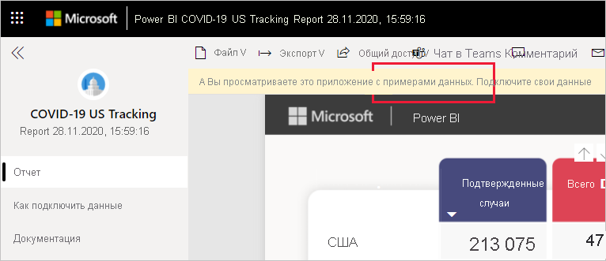

# Подключение к отчету по отслеживанию COVID-19 в США
В этой статье рассказывается, как установить шаблон приложение для отчета по отслеживанию COVID-19 и как подключиться к источникам данных.

Подробные сведения о самом отчете, включая заявления об отказе от ответственности и описание данных, см. в статье [Пример отслеживания ситуации с COVID-19 для федеральных и местных органов власти США](../create-reports/sample-covid-19-us.md).

После установки шаблона приложения и подключения к источникам данных можно настроить отчет в соответствии с вашими потребностями. Затем его можно распространить в виде приложения среди коллег в организации.

## Установка приложения

1. Щелкните следующую ссылку, чтобы перейти к приложению: [шаблон приложения "Отчет по отслеживанию COVID-19 в США"](https://app.powerbi.com/groups/me/getapps/services/pbi-contentpacks.covid19ms)

1. На странице приложения в AppSource нажмите кнопку [**ПОЛУЧИТЬ**](https://app.powerbi.com/groups/me/getapps/services/pbi-contentpacks.covid19ms).

    

1. При появлении запроса нажмите кнопку **Установить**. После установки приложения оно появится на странице "Приложения".

   

## подключение к источникам данных.

1. Чтобы открыть приложение, щелкните его значок на странице "Приложения". Приложение откроется с образцом данных.

1. Щелкните ссылку **Подключите свои данные** в баннере в верхней части страницы.

   

1. Появится диалоговое окно "Параметры". Обязательные параметры отсутствуют. Нажмите кнопку **Далее**.

   

1. Появится диалоговое окно метода проверки подлинности. Рекомендуемые значения предварительно заполнены. Не меняйте их, если не уверены в их назначении.

    Нажмите кнопку **Далее**.

   

1. Нажмите кнопку **Вход**.

   
 
   Отчет подключится к источникам данных и заполнится актуальными данными. В это время вы увидите пример данных и подтверждение того, что обновление выполняется.

   

## Планирование обновления отчета

Когда обновление данных завершится, вы окажетесь в рабочей области, связанной с приложением. [Настройте расписание обновления](../connect-data/refresh-scheduled-refresh.md), чтобы поддерживать данные отчета в актуальном состоянии.

## Настройка и общий доступ

Подробные сведения см. в статье [Настройка приложения и общий доступ к нему](../connect-data/service-template-apps-install-distribute.md#customize-and-share-the-app). Перед публикацией или распространением приложения обязательно ознакомьтесь с [предостережениями](../create-reports/sample-covid-19-us.md#disclaimers).

## Дальнейшие действия
* [Пример отслеживания ситуации с COVID-19 для федеральных и местных органов власти США](../create-reports/sample-covid-19-us.md)
* У вас появились вопросы? [Попробуйте задать вопрос в сообществе Power BI.](https://community.powerbi.com/)
* [Что такое приложения-шаблоны Power BI?](../connect-data/service-template-apps-overview.md)
* [Установка и распространение приложений-шаблонов в организации](../connect-data/service-template-apps-install-distribute.md)
