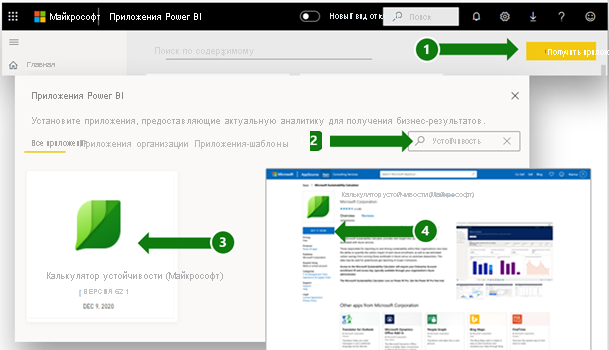
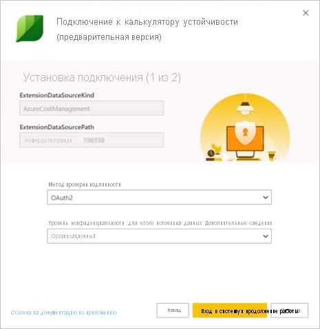
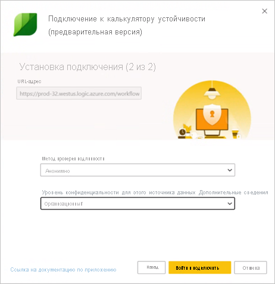

# Страница поддержки Microsoft Sustainability Calculator

Microsoft Sustainability Calculator предоставляет новые аналитические сведения о выбросах углерода, связанных со службами Azure. Лица, ответственные за отчетность и обеспечение стабильного развития в своих организациях, теперь могут количественно оценить влияние на углеродный вклад каждой подписки Azure, а также предполагаемое сокращение выбросов углерода от выполнения этих рабочих нагрузок в Azure по сравнению с локальными центрами обработки данных. Эти данные можно использовать для создания отчетов о выбросах парниковых газах группы 3.

> [!NOTE]
> Эта версия соединителя поддерживает только регистрации с [Azure Enterprise Portal](https://ea.azure.com). Регистрации из Китая в настоящее время не поддерживаются.

## Предварительные требования

Чтобы получить доступ к Microsoft Sustainability Calculator, потребуется получить от администратора Azure вашей организации следующие сведения:

- Идентификатор клиента
- Ключ доступа
- номер соглашения о регистрации;
- Только участники роли администратора Azure могут пройти проверку подлинности и подключить калькулятор к данным компании. (**Только для предварительной версии за декабрь 2020 г.** )

Чтобы найти номер регистрации своей компании, выполните следующие действия.

1. Войдите на [Azure Enterprise Portal](https://ea.azure.com) от имени администратора.
2. Выберите **Active Directory** или **Управление** на панели навигации слева. Отобразится номер регистрации вашей компании.

   

Чтобы найти ключ доступа вашей компании, сделайте следующее.

1. Войдите на [Azure Enterprise Portal](https://ea.azure.com) от имени администратора.
2. Выберите **Отчеты**, а затем выберите **Ключ доступа для этого API**, чтобы получить ключ учетной записи основной регистрации.

## Sustainability Calculator, выпуск за январь 2020 года

### Способы подключения

[!INCLUDE [powerbi-service-apps-get-more-apps](../includes/powerbi-service-apps-get-more-apps.md)]

3. Выберите **Microsoft Sustainability Calculator**, а затем — **Получить сейчас**.

4. В окне **Установить это приложение Power BI?** выберите **Установить**.

5. Выберите элемент **Microsoft Sustainability Calculator** в области **Приложения**.

6. На экране **Начало работы с новым приложением** выберите **Подключиться**.

   

7. Введите **название компании**, **номер регистрации пользователя**, и **число месяцев**. Сведения о получении номера регистрации см. в разделе [Предварительные требования](#prerequisites). Выберите **Далее**.

   

8. Введите следующие сведения:

   | Поле | Значение |
   | --- | --- |
   | **Метод проверки подлинности** | Выберите **Ключ**. |
   | **Ключ учетной записи** | Введите ключ доступа. |
   | **Уровень конфиденциальности для этого источника данных** | Выберите **Организационный**. |

   

9. Выберите **Войти**.

10. Процесс импорта начинается автоматически. После завершения в **области навигации** появится новая панель мониторинга, отчет и модель. Выберите отчет, чтобы просмотреть импортированные данные.

### Использование приложения

Для обновления параметров выполните следующие действия.

1. Перейдите к разделу **Набор данных** и найдите в нем параметры, связанные с рабочей областью приложения.
2. При необходимости обновите **название компании**, **номер регистрации пользователя** и **число месяцев**.
3. Нажмите кнопку **Обновить**, чтобы перезагрузить данные с примененными новыми параметрами.

## Sustainability Calculator (предварительная версия), выпуск за декабрь 2020 года

Microsoft Sustainability Calculator позволяет вычислить текущие выбросы углекислого газа используемыми облачными решениями.

Для точного учета выбросов углекислого газа необходимо получить качественную информацию от партнеров и поставщиков. Microsoft Sustainability Calculator обеспечивает прозрачность данных о выбросах углекислого газа вследствие использования Azure и Microsoft Dynamics.

Благодаря методике, проверенной Стенфордским университетом в 2018 году, система учета выбросов углекислого газа корпорации Майкрософт охватывает все три группы выбросов. В ней используется единообразный и точный подход к учету, позволяющий количественно оценить влияние облачных служб Майкрософт на экологический след клиентов. Корпорация Майкрософт — единственный поставщик облачных служб, обеспечивающий клиентам такой уровень прозрачности при составлении отчетов в добровольном порядке или в соответствии с нормативными требованиями к отчетности.

### Перед началом работы

Microsoft Sustainability Calculator работает на базе Power BI Pro. Если у вас нет Power BI Pro, вы можете [получить бесплатную пробную версию прямо сейчас](https://powerbi.microsoft.com/power-bi-pro).

Вам потребуется номер регистрации Azure. Если у вас его нет, обратитесь за помощью к администратору Azure вашей организации. Дополнительные сведения см. в разделе [Необходимые условия](#prerequisites).

### Подключение калькулятора: пять простых шагов для учета выбросов углекислого газа

1. Скачайте приложение из [AppSource](https://go.microsoft.com/fwlink/?linkid=2151690).

   

   Это приложение можно также найти в Power BI.

   

2. Запустите приложение.

3. Введите номер регистрации. Выберите **Подключите свои данные**, а затем введите номер регистрации. Сведения о получении номера регистрации см. в разделе [Предварительные требования](#prerequisites).

   

4. Подключите свою учетную запись.
   - На этапе **Вы подключаетесь к (1 из 2)** в разделе **Способ проверки подлинности** выберите **OAuth2**, а в разделе **Уровень конфиденциальности для этого источника данных** выберите **Организационный**.

      
 
   - Выберите учетную запись пользователя.

      
       
   - На этапе **Вы подключаетесь к (2 из 2)** в разделе **Способ проверки подлинности** выберите **Анонимный**, а в разделе **Уровень конфиденциальности для этого источника данных** выберите **Организационный**.

     
    
5. Дождитесь создания представления. Для этого может потребоваться до 24 часов.

### Дополнительные ресурсы

- [Видеоинструкции](https://go.microsoft.com/fwlink/?linkid=2151608)
- [Преимущества облачных вычислений с точки зрения выбросов углекислого газа: исследование Microsoft Cloud в партнерстве с WSP](https://download.microsoft.com/download/7/3/9/739BC4AD-A855-436E-961D-9C95EB51DAF9/Microsoft_Cloud_Carbon_Study_2018.pdf)

### Вопросы и ответы

#### Настройка приложения

**Я получаю сообщение об ошибке при подключении данных в калькуляторе. Как быть?**

Сначала проверьте, есть ли у вас права администратора в службе "Управление затратами Azure". Если их нет, запросите такой доступ у администратора. Затем убедитесь, что вы используете правильный номер регистрации.

**Номер регистрации введен, но данные компании не загружаются. В чем проблема?**

Для загрузки данных в общедоступную предварительную версию Sustainability Calculator может потребоваться до 24 часов. Через 24 часа нажмите кнопку **Обновить** в Power BI, чтобы повторить попытку.

**Корпорация Майкрософт пытается переложить на меня свою ответственность за выбросы?**

Нет. Выбросы углекислого газа в связи с работой служб Azure указываются в отчетности как выбросы корпорации Майкрософт группы 1 и 2, что соответствует отраслевому стандарту под названием [Протокол о парниковых газах (ПГ)](https://ghgprotocol.org/). Протокол о ПГ определяет выбросы группы 3 как выбросы другого лица от вашего имени. По сути, такие выбросы учитываются дважды. Microsoft Sustainability Calculator обеспечивает новый уровень прозрачности данных о выбросах группы 3, связанных с использованием служб Azure, в частности категории 1 "Приобретенные товары и услуги" этой 3-й группы.

**Почему уровень выбросов при использовании Microsoft Cloud значительно ниже, чем при использовании локального решения?**

Корпорация Майкрософт провела [исследование, опубликованное в 2018 году](https://blogs.microsoft.com/on-the-issues/2018/05/17/microsoft-cloud-delivers-when-it-comes-to-energy-efficiency-and-carbon-emission-reductions-study-finds/), в котором оценивается разница между Microsoft Cloud и локальными или традиционными центрами обработки данных. Результаты показывают, что эффективность энергопотребления у служб вычислений и хранения Azure на 52–79 процентов выше, чем у традиционных корпоративных центров обработки данных (в зависимости от того, какова эффективность альтернативного локального решения, с которым проводилось сравнение: низкая, средняя или высокая). Учитывая, что мы приобретаем энергию из возобновляемых источников, получается, что Azure эффективнее с точки зрения выбросов углекислого газа на 79–98 процентов. Такая экономия обусловлена четырьмя основными особенностями Microsoft Cloud: эффективностью ИТ-служб, эффективностью ИТ-оборудования, эффективность инфраструктуры центра обработки данных и использованием электроэнергии, получаемой из возобновляемых источников.

**Если операции корпорации Майкрософт не приводят к выбросам углекислого газа, а для их выполнения используется энергия из возобновляемых источников, почему выбросы клиентов в связи с использованием служб Azure не равны нулю?**

Выбросы клиентов корпорации Майкрософт не равны нулю по двум основным причинам. Первая связана с методиками учета ПГ, а вторая — с границами этого анализа. Чтобы свести к нулю выбросы углекислого газа при выполнении операций, корпорация Майкрософт применяет углеродные зачеты, позволяющие снизить вклад определенных источников выбросов, например сжигания топлива на месте осуществления деятельности для обеспечения работы резервных генераторов, систем охлаждения и транспортных средств. Это позволяет свести *чистые* выбросы корпорации Майкрософт к нулю. Калькулятор выдает *валовые* выбросы ПГ до применения таких зачетов. При этом для большей прозрачности на вкладке **GHG Reporting** (Отчеты по ПГ) указываются объемы применяемых зачетов и чистых выбросов. Вторая причина заключается в том, что в дополнение к энергопотреблению и выбросам, связанным с работой центров обработки данных корпорации Майкрософт, при определении следа от выбросов учитывается энергия, используемая поставщиками услуг Интернета, которые осуществляют свою деятельность независимо от корпорации Майкрософт и привлекаются для передачи данных между центрами обработки данных Майкрософт и клиентами Azure.

**Зачем мне эти данные и куда мне нужно их сообщать?**

Эти выбросы могут указываться вашей компанией в отчетах о непрямых выбросах углекислого газа группы 3. Выбросы группы 3 часто указываются в отчетах об устойчивом развитии, при раскрытии данных об изменениях климата в рамках проекта CDP и предоставлении информации другим информационным ресурсам, публикующим различные отчеты. Помимо данных об итоговых объемах выбросов, сведения о сокращении выбросов позволяют наглядно продемонстрировать, как решение вашей компании использовать службы Microsoft Azure способствует глобальному снижению выбросов. Для лучшего понимания контекста приложение указывает снижения выбросов ПГ как эквивалент сэкономленных километров пути транспортного средства, используя коэффициенты калькулятора эквивалентов Агентства по охране окружающей среды США за январь 2020 года.

**Что можно сделать для дополнительного снижения выбросов?**

Экономия ресурсов и эффективность затрат в Azure снижает воздействие на окружающую среду при использовании Azure. Например, наличие неиспользуемых виртуальных машин приводит к нерациональному использованию ресурсов как в облаке, так и в локальной среде. Правильное определение размера виртуальных машин, повышающее коэффициенты использования вычислительных ресурсов (CUF), сокращает энергопотребление на единицу полезных выходных данных, как в случае с физическими серверами. [Служба "Управление затратами Azure"](https://docs.microsoft.com/azure/cost-management-billing/costs/cost-mgt-best-practices) предоставляет средства для планирования, анализа и снижения расходов, позволяющее добиться максимальной окупаемости инвестиций в облачные решения.

#### Методика

**Какая методика используется в этом инструменте?**

Microsoft Sustainability Calculator учитывает используемые облачные службы и связанные с ними требования к энергопотреблению, эффективность центров обработки данных, в которых работают эти службы, топливно-энергетический баланс в регионах, где работают такие центры обработки данных, и приобретение корпорацией Майкрософт энергии из возобновляемых источников. При разработке приложения была проведена сторонняя проверка методики ее реализации, которая позволила обеспечить соответствие стандарту корпоративного учета и отчетности под названием "Протокол о парниковых газах (ПГ)", разработанного Институтом по проблемам мировых ресурсов (WRI) и Всемирным советом предпринимателей по устойчивому развитию (WBCSD). Проверка, проведенная в соответствии со стандартом ISO 14064-3 "Парниковые газы", часть 3 "Спецификация с рекомендациями по проверке отчетности о парниковых газах" включала в себя оценку выбросов, вызванных работой служб Azure, но не учитывала выбросы локальных систем, что придает такой оценке гипотетический характер. Более подробное описание вычислений выбросов углекислого газа приведено в самом средстве на вкладке **Calculation Methodology** (Методика вычисления).

**Какие данные требуются для расчета углеродного следа Azure? Получите ли вы доступ к данным моей компании?**

Приблизительные расчеты выбросов углекислого газа выполняются на основе потребления служб Azure, для определения которого используется метрика "Доход от потребления Azure". У калькулятора нет доступа к вашим хранимым клиентским данным. Данные о потреблении объединяются с данными об энергопотреблении и результатами отслеживания выбросов углекислого газа корпорации Майкрософт для вычисления приблизительного объема выбросов, связанных с использованием служб Azure, с учетом того, в каких именно центрах обработки данных работают эти службы.

**Учитываются ли в этом вычислении все службы и регионы Azure?**

В этих расчетах учитываются все службы Azure во всех регионах Azure, которые связанны с идентификатором клиента, указанным при установке.

#### Характеристика выбросов локальных сред

**Откуда Microsoft Sustainability Calculator получает данные о моих выбросах и операциях в локальной среде?**

Microsoft Sustainability Calculator не получает сведения, касающиеся локальных центров обработки данных, *помимо* той информации, которую предоставили вы сами. Как описано в последующих вопросах и ответах, для получения оценки выбросов локальной среды Microsoft Sustainability Calculator использует отраслевые исследования и введенные пользователем данные об эффективности и балансе источников энергии локальных альтернатив.

**Какие предположения используются при оценке локальных сред? Достигается ли такая экономия только за счет повышения эффективности энергопотребления?**

Эффективность, обеспечиваемая облачными службами Майкрософт, достигается не только благодаря высокой эффективности энергопотребления. Хотя эффективность энергопотребления в центрах обработки данных Майкрософт действительно оптимальна, основные улучшения достигаются за счет эффективности ИТ-служб (динамическая подготовка, мультитенантность, использование серверов) и эффективности ИТ-оборудования (адаптация оборудования к службам, благодаря которой большая часть энергии тратится на полезные выходные данные), а также благодаря эффективности инфраструктуры центров обработки данных (повышения эффективности энергопотребления). В нашем [исследовании за 2018 год](https://blogs.microsoft.com/on-the-issues/2018/05/17/microsoft-cloud-delivers-when-it-comes-to-energy-efficiency-and-carbon-emission-reductions-study-finds/) проведена количественная оценка такой экономии по сравнению с рядом альтернативных локальных центров обработки данных с различным уровнем эффективности (от низкой до высокой). Эти результаты используются для оценки использования энергии, необходимой соответствующему локальному центру обработки данных для предоставления тех же служб, которые используются каждым клиентом в Microsoft Cloud.

**Каков предполагаемый баланс источников энергии в локальной инфраструктуре?**

По умолчанию Microsoft Sustainability Calculator определяет выбросы локальной среды, исходя из предположения, что в ней используется сочетание энергии из возобновляемых источников и невозобновляемой энергии из электросети. Предполагается, что локальный центр обработки данных подключен к той же электросети, что и центры обработки данных Майкрософт. Однако для клиентов, которые приобретают электроэнергию из возобновляемых источников, *в дополнение к* питанию от электросети (например, по соглашениям о закупке электроэнергии), пользователи могут выбрать процент электроэнергии из возобновляемых источников. В этом случае Microsoft Sustainability Calculator соответствующим образом скорректирует выбросы локальной среды.

**В каких случаях следует выбирать низкий, средний или высокий уровень эффективности локальной инфраструктуры?**

Пользователям следует выбрать эффективность, наиболее точно соответствующую локальной развернутой службе, с которым будет проводиться сравнение. При этом необходимо ориентироваться на характеристики оборудования и центра обработки данных.

- **Низкая**. Физические серверы и непосредственно подключенное хранилище в небольшом локализованном центре обработки данных (47–185 квадратных метров).
- **Средняя**. Сочетание физических и виртуализированных серверов и подключенного или выделенного хранилища во внутреннем центре обработки данных среднего уровня (186–1858 квадратных метров).
- **Высокая**. Виртуализированные серверы и выделенное хранилище во внутреннем центре обработки данных высокого уровня (более 1858 квадратных метров).
