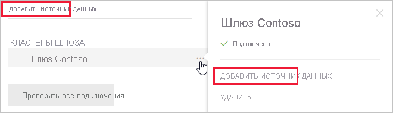
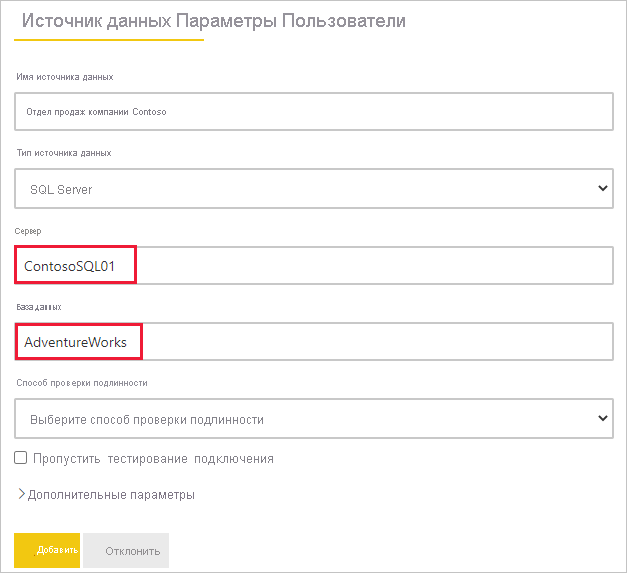

# Добавление и удаление источника данных шлюза

[!INCLUDE [gateway-rewrite](../includes/gateway-rewrite.md)]

Power BI поддерживают многие [локальные источники данных](power-bi-data-sources.md), для каждого из которых существуют свои собственные требования. Шлюз можно использовать для одного источника данных или для нескольких. В этом примере демонстрируется добавление источника данных SQL Server. Эта процедура выполняется аналогично другим источникам данных.

Большинство операций по управлению источниками данных можно выполнять и с помощью API. Дополнительные сведений см. в статье [REST API (шлюзы)](/rest/api/power-bi/gateways).

Если шлюз еще не установлен, см. статью [Установка локального шлюза данных](/data-integration/gateway/service-gateway-install), чтобы приступить к работе.

## Добавление источника данных

1. В заголовке страницы в службе Power BI выберите **Параметры**  > **Управление шлюзами**.

    

2. Выберите шлюз и щелкните **Добавить источник данных**. Можно выбрать текст заголовка **Добавить источник данных** или поместить курсор рядом с записью шлюза, чтобы открыть меню дополнительных параметров.

    

3. Назначьте имя источнику данных, а затем выберите **тип источника данных**. В этом примере мы выбираем SQL Server.

    

4. Введите сведения об источнике данных. Для SQL Server укажите значения в полях **Сервер** и **База данных**.

    

5. Выберите **метод проверки подлинности**, который будет использоваться при подключении к источнику данных. Для SQL Server выберите **Windows** или **Базовый** (проверка подлинности SQL). Введите учетные данные для доступа к источнику данных.

   :::image type="content" source="media/service-gateway-data-sources/basic-auth.png" alt-text="Параметры базовой проверки подлинности.":::

    > [!NOTE]
    > Если выбран метод проверки подлинности OAuth, может произойти сбой любого запроса, который выполняется дольше политики срока действия токена OAuth.

6. В разделе **Дополнительные параметры** можно настроить [Единый вход (SSO)](service-gateway-sso-overview.md) для источника данных. 

    

    Для отчетов на основе DirectQuery можно настроить режим **Использовать единый вход через протокол Kerberos для запросов DirectQuery** или **Использовать единый вход через протокол Kerberos для DirectQuery и импорта запросов**, а для отчетов на основе обновления можно настроить режим **Использовать единый вход через протокол Kerberos для DirectQuery и импорта запросов**.

    Если вы включили режим **Использовать единый вход через протокол Kerberos для запросов DirectQuery** и используете этот источник данных для отчета на основе DirectQuery, применяются учетные данные пользователя, который входит в службу Power BI. Для отчета, основанного на обновлении, будут использоваться учетные данные, введенные в полях **Имя пользователя** и **Пароль**.

    Если вы включили режим **Использовать единый вход через Kerberos для DirectQuery и импорта запросов**, не нужно указывать никаких учетных данных. Если этот источник данных используется для отчета на основе DirectQuery, применяется учетная запись пользователя, сопоставленного с пользователем (Azure) Active Directory, который входит в службу Power BI.  В случае отчета на основе обновления он будет использовать контекст безопасности владельца набора данных.

    > [!NOTE]
    >Единый вход для запросов импорта доступен только для списка источников данных с единым входом в режиме [ограниченного делегирования](service-gateway-sso-kerberos.md) Kerberos.

7. В разделе **Дополнительные параметры** настройте необязательный параметр [Уровень конфиденциальности](https://support.office.com/article/Privacy-levels-Power-Query-CC3EDE4D-359E-4B28-BC72-9BEE7900B540) для источника данных (не применяется к [DirectQuery](desktop-directquery-about.md)).

    :::image type="content" source="media/service-gateway-data-sources/privacy-level.png" alt-text="Параметры уровня конфиденциальности.":::

8. Нажмите кнопку **Добавить**. При успешном завершении процесса вы увидите сообщение *Соединение установлено успешно*.

    

Теперь этот источник данных можно использовать для применения данных из SQL Server в панелях мониторинга и отчетах Power BI.

## Удаление источника данных

Источник данных можно удалить, если он больше не используется. Не забудьте, что при удалении источника данных отключаются все панели мониторинга и отчеты, в которых он используется.

Чтобы удалить источник данных, перейдите к нему и выберите команду **Удалить** в меню дополнительных параметров. Это меню появляется, если поместить курсор рядом с именем источника данных.

## Использование источника данных для запланированного обновления или DirectQuery

После создания источника данных он будет доступен для использования с подключениями DirectQuery или через функцию запланированного обновления. Дополнительные сведения о настройке запланированного обновления см. в статье [Настройка запланированного обновления](refresh-scheduled-refresh.md).

> [!NOTE]
>Имена сервера и базы данных в Power BI Desktop и источнике данных, добавленном в локальный шлюз, должны совпадать.

Связь между набором и источником данных в пределах шлюза основана на именах сервера и базы данных. Эти имена должны совпадать. Например, если вы указали IP-адрес в качестве имени сервера в Power BI Desktop, необходимо использовать такой IP-адрес и для источника данных в конфигурации шлюза. Если вы используете формат *СЕРВЕР\ЭКЗЕМПЛЯР* в Power BI Desktop, нужно использовать тот же формат и в источнике данных, настроенном для шлюза.

Если вы указаны на вкладке **Пользователи** источника данных, настроенного в шлюзе, а имена сервера и базы данных совпадают, вы увидите шлюз в списке вариантов, доступных для использования с запланированным обновлением.

> [!WARNING]
> Если набор данных содержит несколько источников данных, необходимо добавить каждый из них в шлюз. Если в шлюз не добавлен один или несколько источников данных, при запланированном обновлении он не будет отображаться как доступный.

### Ограничения

Локальный шлюз данных поддерживает схему проверки подлинности OAuth только для пользовательских соединителей. Невозможно добавить другие источники данных, требующие OAuth. Если в наборе данных есть источник данных, требующий OAuth, и это не пользовательский соединитель, шлюз невозможно использовать для запланированного обновления.

## Управление пользователями

После добавления источника данных к шлюзу вам нужно предоставить пользователям и группам безопасности с поддержкой почты доступ к этом источнику данных (а не ко всему шлюзу). Список доступа для источника данных определяет, кто может публиковать отчеты, содержащие данные из этого источника данных. Владельцы отчетов могут создавать панели мониторинга, пакеты содержимого и приложения, а также предоставлять доступ к ним другим пользователям.

Также вы можете предоставить пользователям и группам безопасности административный доступ к шлюзу.

> [!NOTE]
> Пользователи с доступом к источнику данных могут связать наборы данных с источником данных и выполнить подключение на основе параметров безопасности (сохраненных учетных данных или единого входа), выбранных при создании источника данных.

### Добавление пользователей к источнику данных

1. В заголовке страницы в службе Power BI выберите **Параметры**  > **Управление шлюзами**.

2. Выберите источник данных, к которому вы хотите добавить пользователей.

3. Выберите **Пользователи** и введите пользователей и группы безопасности с поддержкой электронной почты из вашей организации, которые будут получать доступ к выбранному источнику данных. Нажмите **Добавить**, и имя добавленного члена будет добавлено в список пользователей, которые могут публиковать отчеты, использующие этот источник данных.

    

Помните, что необходимо добавить пользователей для каждого источника данных, к которому вы хотите предоставить доступ. У каждого источника данных есть собственный список пользователей. Для каждого источника данных пользователи добавляются отдельно.

### Удаление пользователей из источника данных

На вкладке **Пользователи** для источника данных можно удалять пользователей или группы безопасности, которые могут с ним работать.

## Хранение зашифрованных учетных данных в облаке

При добавлении источника данных в шлюз необходимо указать учетные данные для доступа к этому источнику. Все запросы к источнику данных будут выполняться с использованием этих учетных данных. Учетные данные надежно шифруются. Для этого применяется симметричное шифрование, благодаря чему данные не могут быть расшифрованы в облаке перед сохранением в облако. Учетные данные отправляются на локальный компьютер со шлюзом и расшифровываются при обращении к источникам данных.

## Список доступных типов источников данных

Сведения о том, какие источники данных поддерживает локальный шлюз данных, см. в статье [Источники данных Power BI](power-bi-data-sources.md).

## Дальнейшие действия

* [Управление своим источником данных — службы Analysis Services](service-gateway-enterprise-manage-ssas.md)
* [Управление своим источником данных — SAP HANA](service-gateway-enterprise-manage-sap.md)
* [Управление своим источником данных — SQL Server](service-gateway-enterprise-manage-sql.md)
* [Управление своим источником данных — Oracle](service-gateway-onprem-manage-oracle.md)
* [Управление источником данных — импорт или запланированное обновление](service-gateway-enterprise-manage-scheduled-refresh.md)
* [Руководство по развертыванию шлюза данных](service-gateway-deployment-guidance.md)

Остались вопросы? Ответы на них см. в [сообществе Power BI](https://community.powerbi.com/).
