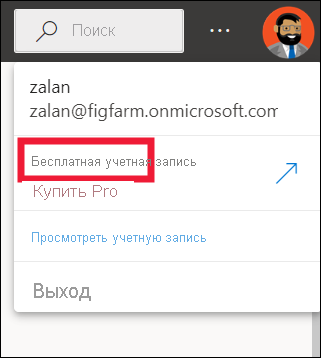

# Лицензии и подписки для *бизнес-пользователей*

[!INCLUDE[consumer-appliesto-ynnn](../includes/consumer-appliesto-ynnn.md)]

В качестве [*бизнес-пользователя*](end-user-consumer.md) вы используете службу Power BI для просмотра отчетов и панелей мониторинга, чтобы принимать деловые решения на основе данных. Если вы работаете в Power BI в течение некоторого времени или общаетесь с коллегами-*конструкторами*, вероятно, вы уже знаете, что некоторые функции работают только при наличии лицензии, подписки или разрешений определенного типа.

Возможные действия в службе Power BI зависят от трех факторов:
-    типа лицензии и подписки;
-    места хранения содержимого;
-    назначенных ролей и разрешений.

В этой статье описываются возможности каждого типа лицензии и то, как *место хранения содержимого* может влиять на *возможные действия с ним*. Вы также узнаете, где можно найти свою лицензию и подписку и как определить, где хранится содержимое. Дополнительные сведения о ролях и разрешениях см. в описании [ролей в рабочих областях](end-user-workspaces.md).

## Лицензии

Каждый пользователь службы Power BI имеет *бесплатную* лицензию, лицензию *Pro* или лицензию *Premium на пользователя* *. Если вы являетесь *бизнес-пользователем* Power BI, вы, вероятно, используете лицензию, управляемую администратором Power BI.

Одновременно можно иметь несколько лицензий.  Возможности в службе всегда соответствуют лицензии с разрешениями самого высокого уровня.

## Подписка на емкость Power BI Premium

Premium — это *подписка* для организаций с альтернативным способом хранения содержимого — в виртуальном контейнере, который называется *емкость*. Благодаря емкости Premium все пользователи с разрешениями — как в организации, так и за ее пределами — могут просматривать содержимое в такой емкости Premium, не приобретая отдельные лицензии Power BI Pro или Premium на пользователя. 

Емкость Premium позволяет распространять содержимое пользователям Pro, и при этом для просмотра этого содержимого получателями лицензии Pro не требуются. Пользователь, создающий содержимое в емкости Premium, использует лицензии Pro для подключения к источникам данных, моделированию данных, а также создания отчетов и панелей мониторинга, сохраняемых в рабочей области в емкости Premium. Пользователи без лицензии Pro по-прежнему могут получить доступ к рабочей области, которая находится в емкости Power BI Premium, если у них есть [роль в этой рабочей области](end-user-workspaces.md). Если владелец рабочей области создает приложение на основе содержимого в этой рабочей области, пользователи без лицензии Pro по-прежнему смогут просматривать это приложение в емкости Premium при условии, что им были предоставлены разрешения для этого приложения. 

В таких рабочих пространствах конструкторы назначают различные роли, например **Читатель**, **Участник**, **Член** и **Администратор**. Эти роли определяют возможности взаимодействия пользователей с содержимым. Дополнительные сведения см. в статье о [разрешениях и ролях в рабочих областях](end-user-workspaces.md). 

Когда разработчик создает и публикует приложение, он предоставляет доступ всем организациям или лицам. Область, в которой можно взаимодействовать с содержимым приложения, зависит от конкретных предоставленных разрешений на доступ. Например, вам может быть предоставлен доступ для просмотра приложения, подключения к базовым наборам данных, создания копий отчетов или предоставления общего доступа к содержимому.

Дополнительные сведения о емкости Premium см. в статье [Что такое Microsoft Power BI Premium?](../admin/service-premium-what-is.md).

## Определение имеющихся лицензий
Выберите изображение профиля, чтобы отобразить сведения об учетной записи. Залан использует бесплатную лицензию. Другие типы лицензий: **Pro** и **Premium на пользователя**. 

Чтобы просмотреть дополнительные сведения о вашей учетной записи, выберите **Просмотреть учетную запись**. 

<!-- [Your Microsoft **My account** page](https://portal.office.com/account) opens in a new browser tab.  To see what licenses are assigned to you.  Select the tab for  **Subscriptions**.

This first user, Pradtanna, has Office 365 E5, which includes a Power BI Pro license.

This second user, Zalan, has a Power BI free license. 

 

## Find out if you have access to Premium capacity

Next, check to see if you're part of an organization that has Premium capacity. Either of the users above, Pro or free, could belong to an organization that has Premium capacity.  Let's check for our second user, Zalan.  

We can determine whether Zalan's organization has Premium capacity by looking up the amount of storage available. 

- In the Power BI service, select **My workspace** and then select the cog icon from the upper right corner. Choose **Manage personal storage**.

    

    If you see more than 10 GB, then you're a member of an organization that has a Premium subscription. The image below shows that Zalan's organization has up to 100 GB of storage. Zalan, personally, doesn't own 100GB as indicated by the heading **Owned by us**.  

    

    Notice that a Pro user has already shared a workspace with Zalan. The diamond icon shows that this workspace is stored in Premium capacity. 

    If you see any amount of storage, the words **Pro user** next to your name, and the heading **Owned by me**, then you have a Premium per-user license.  

    -->

## Определение содержимого, размещенного в емкости Premium

Есть несколько способов определения содержимого, хранящегося в емкости Premium. Один из способов — найти приложения и рабочие области приложений со значком бриллианта. Он означает, что содержимое хранится в емкости Premium. 

На рисунке ниже три приложения хранятся в емкости Premium.

Если *конструктор* размещает рабочую область в емкости Premium, пользователь с бесплатной лицензией может просматривать общее содержимое, совместно работать с коллегами, использовать панели мониторинга и отчеты, а также выполнять другие действия **в этой рабочей области**. Спектр его разрешений задает администратор Power BI и конструктор содержимого.

## Сборка

Есть разные способы организации подписок и лицензий Power BI. Для *бизнес-пользователей* один из наиболее распространенных сценариев — когда организация покупает подписку уровня Premium, администратор назначает лицензии Pro небольшой группе пользователей, а все остальные пользователи работают с бесплатными лицензиями. Как правило, администратор назначает лицензии Pro сотрудникам, которые будут создавать и совместно использовать содержимое. Пользователи Pro создают [рабочие области](end-user-workspaces.md) и добавляют в них содержимое (панели мониторинга, отчеты, наборы данных, приложения). Чтобы пользователи с бесплатной лицензией могли совместно работать с другими в этих рабочих областях, администратор или пользователь Pro должны назначить областям *емкость Premium*.  

|Тип лицензии  |Не в емкости Premium | Емкость Premium  |
|---------|---------|---------|
|**Бесплатный**     |  Используется в качестве личной песочницы, в которой можно создавать содержимое для себя и работать с ним. Бесплатная лицензия — это отличный способ опробовать службу Power BI. Вы не можете работать с содержимым других пользователей или делиться своим содержимым с ними. 1     |   Работайте с содержимым, назначенным емкости Premium и предоставленным вам. Пользователи с бесплатными лицензиями, лицензиями Pro и лицензиями Premium на пользователя могут работать совместно.      |
|**Pro**     |  Работайте совместно с другими пользователями с лицензиями Pro и Premium на пользователя, создавая и совместно используя содержимое.        |  Работайте совместно с другими пользователями с бесплатными лицензиями, а также лицензиями Pro и Premium на пользователя, создавая и совместно используя содержимое.       |

1 См. раздел [Рекомендации и устранение неполадок](#considerations-and-troubleshooting).

На приведенной ниже схеме слева представлены пользователи Pro, которые создают и совместно используют содержимое в рабочих областях приложений.

- **Рабочая область A** не была создана в емкости Premium.

- **Рабочая область B** создана и сохранена в емкости Premium. У этой рабочей области есть значок бриллианта.  

    

*Конструктор* Power BI Pro может совместно использовать ресурсы и работать с другими пользователями Pro в любой из рабочих областей. Однако пользователь Power BI Pro может делиться содержимым и совместно работать с пользователями бесплатных лицензий только в рабочей области B, которая находится в емкости Premium.  В рабочей области конструктор назначает роли участникам совместной работы. Роль определяет действия, которые можно выполнять в рабочей области. *Бизнес-пользователям* Power BI, как правило, назначается роль *Читатель*. Дополнительные сведения о ролях см. в статье [Совместная работа в рабочих областях](end-user-workspaces.md).

## Рекомендации и устранение неполадок

- Можно иметь несколько лицензий Power BI. Возможности в службе Power BI всегда соответствуют имеющейся лицензии наиболее высокого уровня. Например, если у вас есть и лицензия Pro, и бесплатная лицензия, служба Power BI будет использовать лицензию Pro.

- Если вы хотите создавать и совместно использовать содержимое (панели мониторинга, отчеты, приложения) или открывать содержимое, к которым вам предоставлен доступ, вам потребуется лицензия Pro или Premium на пользователя. Вы можете зарегистрироваться для получения бесплатной 60-дневной индивидуальной пробной версии Power BI Pro. Выберите диалоговое окно перехода на другую лицензию, которое появляется в службе Power BI при попытке использования функции Pro.

    

  После истечения срока действия 60-дневной пробной версии ваша лицензия меняется обратно на бесплатную лицензию Power BI. После смены лицензии вы потеряете доступ к функциям, для работы с которыми требуется лицензия Power BI Pro. Если вы хотите продолжить использование лицензии Pro, обратитесь к администратору или в службу технической поддержки ИТ с просьбой приобрести лицензию Power BI Pro. Если у вас нет администратора или службы технической поддержки ИТ, перейдите на [страницу с ценами на Power BI](https://powerbi.microsoft.com/pricing/).

- Если вы зарегистрировались на бесплатную лицензию самостоятельно, нажав кнопку на подобие *Попробовать бесплатно*, срок ее действия не истечет. Поэтому если вы выполнили обновление до пробной версии Pro, а затем ее срок действия истек, или ваша организация предоставила вам лицензию Pro, а затем отозвала ее, у вас по-прежнему останется бесплатная лицензия, если только вы ее не отмените.

- 1 Бесплатная пользовательская лицензия на службу Power BI идеально подходит для знакомства со службой или ее использования в целях анализа и визуализации личных данных в разделе **Моя рабочая область**. Ее нельзя использовать для совместной работы с коллегами в Power BI. Изолированные пользователи с бесплатными лицензиями не могут просматривать содержимое, опубликованное другими пользователями, или публиковать собственное содержимое для других пользователей Power BI.

## Дальнейшие действия

- [Являюсь ли я *бизнес-пользователем* Power BI?](end-user-consumer.md)    
- [Сведения о рабочих областях](end-user-workspaces.md)    
- [Функции Power BI для бизнес-пользователей по типам лицензий](end-user-features.md)
