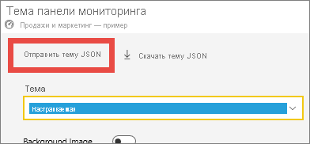
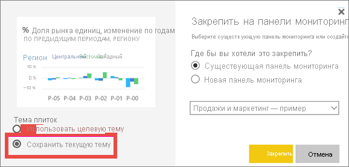
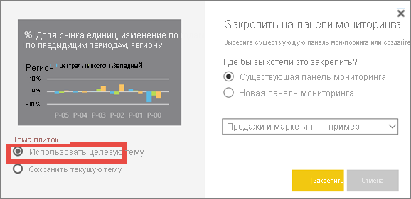

# <a name="use-dashboard-themes-in-the-power-bi-service"></a>Использование тем панели мониторинга в службе Power BI
С помощью **тем панели мониторинга** ко всей панели мониторинга можно применить требуемую цветовую тему, например корпоративные цвета, цвета времен года или другие цветовые темы. При применении темы панели мониторинга для всех визуальных элементов на ней используются цвета из выбранной схемы. Однако имеется ряд исключений, как описано в разделе [Рекомендации и ограничения](#considerations-and-limitations) этой статьи.


Изменение цветов для визуальных элементов отчета на панели мониторинга не влияет на визуальные элементы в связанном отчете. Кроме того, при закреплении плиток из отчета, к которому уже [применена тема отчета](desktop-report-themes.md), можно оставить текущую тему или использовать тему панели мониторинга.


## <a name="prerequisites"></a>Предварительные условия
* Чтобы продолжить работу, откройте [панель мониторинга "Продажи и маркетинг — пример"](sample-datasets.md).


## <a name="how-dashboard-themes-work"></a>Как применяются темы панели мониторинга
Чтобы приступить к работе, откройте панель мониторинга, которую вы создали или которая доступна вам для изменения. Выберите **Изменить** > **Тема панели мониторинга**. 


В появившейся области панели мониторинга выберите одну из готовых тем.  В приведенном ниже примере мы выбрали тему **Темная**.


## <a name="create-a-custom-theme"></a>Создание пользовательской темы

Тема по умолчанию для панелей мониторинга Power BI — **Светлая**. Чтобы настроить цвета или создать собственную тему, в раскрывающемся списке выберите пункт **Пользовательская**. 


Чтобы создать собственную тему панели мониторинга, используйте пользовательские параметры. При добавлении фонового изображения рекомендуется, чтобы оно имело разрешение не менее 1920 x 1080 пикселей. Чтобы использовать изображение в качестве фона, отправьте его на общедоступный веб-сайт, скопируйте URL-адрес и вставьте его в поле для **URL-адреса изображения**. 

## <a name="use-a-json-theme"></a>Использование темы JSON
Другой способ создать пользовательскую тему — передать файл JSON с параметрами всех цветов, которые следует использовать для панели мониторинга. В Power BI Desktop авторы отчетов используют файлы JSON с целью [создания тем для отчетов](desktop-report-themes.md). Такие же файлы JSON можно передавать для панелей мониторинга. Кроме того, можно найти и передать файлы JSON со [страницы коллекции тем](https://community.powerbi.com/t5/Themes-Gallery/bd-p/ThemesGallery) в сообществе Power BI. 


Вы также можете сохранить пользовательскую тему как файл JSON и поделиться им с другими создателями панелей мониторинга. 

### <a name="use-a-theme-from-the-theme-gallery"></a>Использование темы из коллекции тем

Как и при использовании встроенных и настраиваемых параметров, при отправке темы цвета автоматически применяются ко всем плиткам на панели мониторинга. 

1. Наведите указатель на тему и выберите пункт **Просмотреть отчет**.

    

2. Прокрутите содержимое окна вниз и найдите ссылку на файл JSON.  Щелкните значок скачивания и сохраните файл.

    

3. Вернувшись в службу Power BI, в окне пользовательской темы панели мониторинга нажмите кнопку **Отправить тему JSON**.

    

4. Перейдите в расположение, в котором был сохранен JSON-файл темы, и нажмите кнопку **Открыть**.

5. На странице темы панели мониторинга нажмите кнопку **Сохранить**. Новая тема будет применена к панели мониторинга.

    

## <a name="reports-and-dashboards-with-different-themes"></a>Отчеты и панели мониторинга с разными темами

Если в отчете используется тема, которая отличается от темы панели мониторинга, в большинстве случаев можно указать, сохранит ли визуальный элемент текущую тему отчета или использует тему панели мониторинга. Однако визуальные элементы карточек на панелях мониторинга используют семейство шрифтов "DIN" с черным текстом. Цвет текста для всех плиток на панели мониторинга, включая карточки, можно изменить, создав настраиваемую тему панели мониторинга.

- Чтобы оставить тему отчета при закреплении плитки на панели мониторинга, выберите параметр **Сохранить текущую тему**. Визуальный элемент на панели мониторинга сохранит тему отчета, включая параметры прозрачности.

    Параметры **темы плиток** отображаются в единственной ситуации: если вы создали отчет в Power BI Desktop, [добавили тему отчета](desktop-report-themes.md), а затем опубликовали отчет в службе Power BI.

    

- Попробуйте повторно закрепить плитку и выбрать параметр **Использовать тему панели мониторинга**.

    

## <a name="dashboard-theme-json-file-format"></a>Формат файла JSON для темы отчета

На самом базовом уровне JSON-файл темы содержит только одну обязательную строку: **name**.

```json
{
    "name": "Custom Theme"
}
```

Все, кроме **имени**, является необязательным. Это означает, что вы можете добавлять в файл темы только те свойства, которые хотите отформатировать, и продолжать использовать настройки Power BI по умолчанию для остальных.

Файл JSON для панели мониторинга содержит следующие данные:

- name (имя). Имя темы (только обязательное поле).
- foreground (передний фон) и background (задний фон). Цвета для панели мониторинга.
- dataColors (цвета данных). Список шестнадцатеричного кода, используемого для данных в диаграммах. Можно включить любое количество цветов.
- tiles (плитки). Конфигурации фона и цвета для панелей мониторинга.
- visualStyles (стиль визуальных элементов). Детализированное форматирование для визуальных элементов.

Ниже приведен пример темы JSON для светлой темы по умолчанию.

```json
{

"name":"Light",

"foreground":"#000000",

"background":"#EAEAEA",

"dataColors":["#01B8AA","#374649","#FD625E","#F2C80F","#5F6B6D","#8AD4EB","#FE9666","#A66999"],

"tiles":{"background":"#FFFFFF","color":"#000000"},

"visualStyles":{"*":{"*":{"*":[{"color":{"solid":{"color":"#000000"}}}]}}}

}
```

## <a name="considerations-and-limitations"></a>Рекомендации и ограничения

* Темы панели мониторинга не применяются к закрепленным динамическим страницам отчетов, плиткам IFrame, плиткам SSRS, плиткам книги или изображениям.
* Темы панели мониторинга можно просматривать на мобильных устройствах, но создавать их можно только в службе Power BI.
* Пользовательские темы панели мониторинга работают только с плитками, закрепленными из отчетов.

## <a name="next-steps"></a>Дальнейшие действия

- [Применение тем к отчетам](desktop-report-themes.md)
