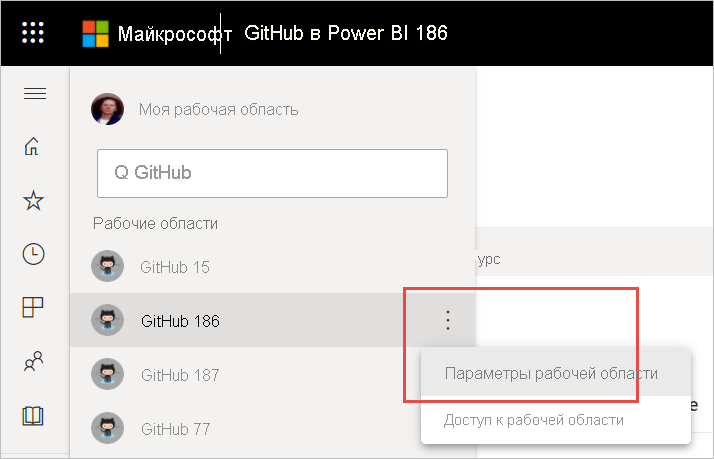

# Удаление содержимого в службе Power BI
В этой статье показано, как удалять панели мониторинга, отчеты, книги, наборы данных, приложения, визуализации и рабочие области в службе Power BI. Вы можете удалить практически любые данные в службе Power BI, за некоторыми исключениями. 

## Удаление панели мониторинга, отчета, набора данных или книги

1. В рабочей области перейдите на вкладку **Все**.
1. Выберите **Дополнительные параметры (...)** рядом с ресурсом, который хотите удалить, и выберите **Удалить**.

    

1. Выберите **Удалить**, чтобы подтвердить удаление.

## Удаление приложения из страницы со списком приложений

Вы можете легко удалить приложения на странице списка приложений. Удаление приложения не приводит к удалению приложения для других участников. Только администратор или член рабочей области может окончательно удалить приложение из этой рабочей области.

1. В области навигации выберите **Приложения**, чтобы открыть страницу со списком приложений.
2. Наведите указатель мыши на название приложения, которое необходимо удалить, и щелкните значок удаления :::image type="icon" source="media/service-delete/power-bi-delete-report2.png" border="false":::.

   

   Если вы случайно удалили приложение, его можно восстановить несколькими способами.  Например, вы можете попросить автора приложения повторно отправить его вам, найти письмо со ссылкой на это приложение, проверить наличие уведомления для приложения в [центре уведомлений](../consumer/end-user-notification-center.md) или проверить [AppSource организации](../consumer/end-user-apps.md).

## Удаление рабочей области

Power BI имеет два вида рабочих областей: оригинальные (или *классические*) рабочие области и новые рабочие области. Процессы их удаления различны. Узнайте больше о [новых и классических рабочих областях](../collaborate-share/service-new-workspaces.md).

### Удаление участников из новой рабочей области

Только администраторы рабочей области могут удалять пользователей из новой рабочей области. Если вы являетесь администратором, то можете удалить себя или других пользователей. Но если вы являетесь единственным администратором рабочей области, Power BI не позволит вам удалить себя.

1. В представлении списка рабочих областей выберите **Доступ** в правом верхнем углу.

    :::image type="content" source="media/service-delete/power-bi-select-access.png" alt-text="Снимок экрана: выбор элемента &quot;Доступ&quot;":::

1. В области **Доступ** выберите **Дополнительные параметры (...)** рядом с именем пользователя, которого нужно удалить, и выберите **Удалить**.

    :::image type="content" source="media/service-delete/power-bi-access-remove.png" alt-text="Снимок экрана: выбор элемента &quot;Удалить&quot; в области &quot;Доступ&quot;":::

### Удаление новой рабочей области

При создании одной из *новых рабочих областей* не создается связанная группа Microsoft 365. Если вы являетесь администратором рабочей области, то можете удалить новую рабочую область, не затрагивая группы Microsoft 365. Узнайте больше о [новых и классических рабочих областях](../collaborate-share/service-new-workspaces.md).

Являясь администратором рабочей области, вы можете удалить эту область или пользователей в ней. При удалении рабочей области приложения также удаляется связанное приложение для всех участников группы; кроме того, приложение удаляется из AppSource. 

1. В области навигации выберите **Рабочие области**.

2. Выберите **Дополнительные параметры** (...) справа от рабочей области, которую необходимо удалить, и команду **Параметры рабочей области**.

    

3. В окне **Параметры рабочей области** выберите **Удалить рабочую область** > **Удалить**.

### Удаление классической рабочей области из списка

Если вы больше не хотите быть участником классической рабочей области, из нее можно **_выйти_* _, после чего она будет удалена из списка. Выход из рабочей области не влияет на других ее участников.  

> [!NOTE]
> Если вы единственный администратор рабочей области, служба Power BI не позволит вам выйти из состава рабочей области.
>

1. Войдите в рабочую область, которую нужно удалить.

2. В правом верхнем углу щелкните _ *Дополнительные параметры** (...) и выберите команды **Выйти из рабочей области** > **Выйти**.

      :::image type="content" source="media/service-delete/power-bi-leave-workspace.png" alt-text="Снимок экрана: элементы &quot;Дополнительные параметры&quot; и &quot;Выйти из рабочей области&quot;":::

   > [!NOTE]
   > Параметры, доступные в раскрывающемся списке, зависят от того, являетесь ли вы администратором или участником рабочей области.
   >

### Удаление классической рабочей области

> [!WARNING]
> При создании *классической* рабочей области создается группа Microsoft 365. При удалении классической рабочей области эта группа Microsoft 365 удаляется. Группа также удаляется и из других продуктов Microsoft 365, таких как SharePoint и Microsoft Teams.
> 

Удаление рабочей области отличается от выхода из нее. Чтобы удалить рабочую область, нужно быть ее администратором. При удалении связанное приложение также удаляется для всех участников группы и из AppSource. Но если вы являетесь единственным администратором рабочей области, Power BI не позволит вам выйти из нее.

1. В области навигации выберите **Рабочие области**.

2. Рядом с рабочей областью, которую необходимо удалить, выберите **Дополнительные параметры (...)**  > **Параметры рабочей области**.

    

3. В области **Параметры** выберите **Удалить рабочую область** и подтвердите, выбрав **Удалить**.

    

## Рекомендации и ограничения

- При удалении *панели мониторинга* базовый набор данных и связанные с ней отчеты не удаляются.
- Если вы являетесь *владельцем панели мониторинга или отчета*, то можете удалить их. Если вы предоставили доступ к ним коллегам, при удалении из Power BI они будут удалены и из рабочих областей Power BI этих коллег.
- Если вам предоставлен общий доступ к *панели мониторинга или отчету*, вы не можете их удалить.
- При удалении отчета не происходит удаление набора данных, являющегося его основой.  Все визуализации, закрепленные на панели мониторинга из отчета, также не затрагиваются. Они остаются на панели мониторинга до тех пор, пока не вы не удалите их по отдельности.
- Вы можете удалить *набор данных*. Но при удалении набора данных также удаляются все плитки отчетов и панелей мониторинга, содержащие данные из этого набора данных.
- Вы можете удалить *книги*. Но при удалении книги также удаляются все плитки отчетов и информационных панелей, содержащие данные из этой книги. Если книга хранится в OneDrive для бизнеса, после ее удаления из Power BI она по-прежнему остается в OneDrive.
- Если *панель мониторинга или отчет* является частью [пакета содержимого организации](../collaborate-share/service-organizational-content-pack-disconnect.md), удалить их с помощью этого метода невозможно.  Дополнительные сведения см. в статье [Удаление подключения к пакету содержимого организации в Power BI](../collaborate-share/service-organizational-content-pack-disconnect.md).
- Если *набор данных* входит в состав одного пакета содержимого организации или нескольких, единственный способ удалить его из этих пакетов — дождаться завершения его обработки, а потом еще раз попытаться удалить.

## Дальнейшие действия

В этой статье описаны способы удаления основных стандартных блоков службы Power BI. Ниже указано несколько других объектов, которые также можно удалить.  

- [Удаление основной информационной панели](../consumer/end-user-featured.md)
- [Удаление информационной панели из избранного](../consumer/end-user-favorite.md)
- [Изменение и удаление плитки на информационной панели](service-dashboard-edit-tile.md)

Остались вопросы? [Ответы на них см. в сообществе Power BI.](https://community.powerbi.com/)