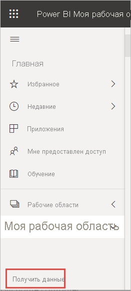

# Создание отчета из файла Excel в службе Power BI
Вы ознакомились со статьей [Отчеты в Power BI](../consumer/end-user-reports.md) и хотите создать свои собственные отчеты. Существуют различные способы создания отчета. В этой статье мы создадим в службе Power BI простой отчет из файла Excel. Поняв принцип создания отчета, вы можете ознакомиться с более подробными темами, перечисленными в разделе [Дальнейшие действия](#next-steps) в конце статьи.  

## Технические условия
- [Регистрация в службе Power BI](../fundamentals/service-self-service-signup-for-power-bi.md). 
- [Скачайте файл Excel "Анализ розничной торговли — пример"](https://go.microsoft.com/fwlink/?LinkId=529778) и сохраните его в OneDrive для бизнеса или в локальной среде.

## Импорт файла Excel
Чтобы создать отчет таким способом, сначала вам потребуется файл и пустой холст отчета. Вы можете продолжить работу с файлом Excel "Анализ розничной торговли — пример".

1. На панели навигации выберите **Моя рабочая область** .
   
   :::image type="content" source="media/service-report-create-new/power-bi-select-my-workspace.png" alt-text="Снимок экрана: выбор &quot;Моей рабочей области&quot;.":::
2. В нижней части области навигации выберите **Получить данные** .
   
   
3. Выберите **Файлы** и перейдите к расположению, в котором вы сохранили пример анализа розничной торговли.
   
    
4. Для этого упражнения выберите **Импорт** .
   
   
5. Выберите **Open** (Открыть).

   После импорта файла Excel он отображается в виде *набора данных* в списке рабочей области.

1. Щелкните **Дополнительные параметры**  (…) рядом с набором данных и выберите пункт **Создать отчет** .
   
   :::image type="content" source="media/service-report-create-new/power-bi-dataset-create-report.png" alt-text="Снимок экрана: выбор &quot;Моей рабочей области&quot;.":::
6. Откроется редактор отчетов. 
   
   

> [!TIP]
> Щелкните значок меню, чтобы скрыть область навигации и освободить место.
> 
> :::image type="content" source="../media/power-bi-hide-navigation-pane.png" alt-text="Снимок экрана: выбор &quot;Моей рабочей области&quot;.":::

## Добавление диаграммы "Радиальный датчик" в отчет
После импорта набора данных сначала ответим на некоторые вопросы.  Руководитель отдела маркетинга хочет знать, насколько мы близки к запланированному показателю продаж в этом году. Визуальный элемент "Датчик" [хорошо подходит](../visuals/power-bi-report-visualizations.md) для отображения такого типа информации.

1. В области "Поля" выберите **По продажам** > **This Year Sales** (Продажи за этот год) > **Значение** .
   
    
2. Преобразуйте визуальный элемент в датчик, выбрав соответствующий шаблон  в области **Визуализации** .
   
    
3. Перетащите поле **Sales** (Продажи) > **This Year Sales** (Продажи за этот год) > **Goal** (Цель) в столбец **Целевое значение** . Похоже, мы очень близки к цели.
   
    
4. Теперь сохраните отчет.
   
   

## Добавление диаграммы с областями и среза в отчет
Руководитель отдела маркетинга имеет дополнительные вопросы. Он хотел узнать об уровне продаж в этом году по сравнению с предыдущим, а также хотел бы увидеть результаты по региону.

1. Во-первых, создадим дополнительное пространство на холсте. Выберите визуальный элемент "Датчик" и переместите его в правый верхний угол. Затем перетащите один из углов, чтобы уменьшить размер холста.
2. Отмените выбор визуального элемента "Датчик". В области "Поля" выберите **По продажам** > **This Year Sales** (Продажи за этот год) > **Значение** и выберите **По продажам** > **Last Year Sales** (Продажи за прошлый год).
   
    
3. Преобразуйте визуальный элемент в диаграмму с областями, выбрав соответствующий шаблон  в области **Визуализации** .
4. Выберите **Время** > **Период** , чтобы добавить время в качестве **оси** .
   
    
5. Чтобы отсортировать визуальные элементы по времени, нажмите кнопку с многоточием и выберите **Sort by Period** (Сортировать по периоду).
6. Теперь добавим срез. Щелкните пустую область на холсте и выберите шаблон Slicer  (Срез). После этого на холсте появится пустой срез.
   
        
7. В области "Поля" выберите **District** (Округ) > **District** (Округ). Переместите срез и измените его размер.
   
      
8. Срез позволяет находить шаблоны и аналитические сведения по округу.
   
     

Продолжайте анализировать данные и добавлять визуализации. Если вы найдете особенно интересную информацию, [закрепите ее на панели мониторинга](service-dashboard-pin-tile-from-report.md).

## Дальнейшие действия

* [Закрепление визуализаций на панели мониторинга](service-dashboard-pin-tile-from-report.md)
* [Изменение параметров отчета в службе Power BI](power-bi-report-settings.md)
* Появились дополнительные вопросы? [Ответы на них см. в сообществе Power BI.](https://community.powerbi.com/)
