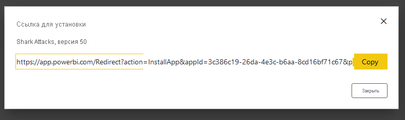
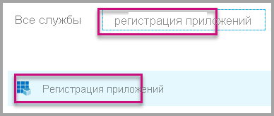
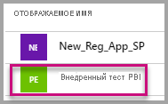
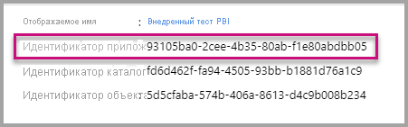
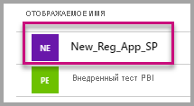
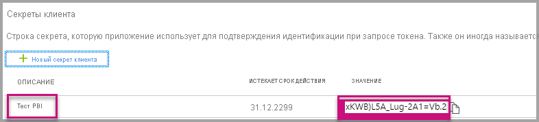

# <a name="tutorial-automate-configuration-of-template-app-installation-using-an-azure-function"></a>Руководство. Автоматизация настройки установки приложения-шаблона с помощью функции Azure

Приложения-шаблоны — это отличный способ начать получать ценную информацию из своих данных. Для быстрого запуска приложений-шаблонов достаточно подключить их к своим данным. Приложения-шаблоны предоставляют клиентам готовые отчеты, которые при желании можно настроить на свой вкус.

Пользователям не всегда известно, как подключить свои данные. Указание этих сведений при установке приложения-шаблона может оказаться для них проблемой.

Если вы являетесь поставщиком служб данных и создали приложение-шаблон, чтобы помочь своим клиентам начать работу с данными в своей службе, можно упростить установку приложения-шаблона, автоматизировав настройку его параметров.

Когда клиент входит на портал, он переходит по специальной ссылке, которую вы подготовили. Эта ссылка:

- запускает автоматизацию, которая собирает необходимые сведения;
- предварительно настраивает параметры приложения-шаблона;
- перенаправляет клиента в учетную запись Power BI, где можно установить приложение.

Все, что нужно сделать, — это нажать **Установить**, пройти проверку подлинности в источнике данных, и все готово!

Пользовательский интерфейс показан ниже.


В этом учебнике будет использоваться пример функции автоматической установки Azure, созданный для предварительной настройки и установки приложения-шаблона. Этот пример намеренно упрощен в целях наглядности. Он инкапсулирует настройку функции Azure, чтобы использовать API Power BI для установки приложения-шаблона и его автоматической настройки для пользователей.

Дополнительные сведения об общем процессе автоматизации и используемых приложением API см. в разделе [Автоматизация настройки установки приложения-шаблона.](template-apps-auto-install.md)

В нашем простом приложении используется функция Azure. Дополнительные сведения о функциях Azure см. в [документации по функциям Azure](https://docs.microsoft.com/azure/azure-functions/).

## <a name="basic-flow"></a>Базовый поток действий

Ниже представлен основной порядок действий, выполняемых приложением, когда клиент запускает его, щелкнув ссылку на портале.

1. Пользователь входит на портал поставщика ISV и щелкает ссылку. Это действие инициирует поток. На этом этапе портал ISV подготавливает конфигурацию пользователя.

1. ISV получает маркер *только для приложения* на основе [субъекта-службы (маркера только для приложения)](../embedded/embed-service-principal.md), который зарегистрирован в клиенте ISV.

1. С помощью [REST API Power BI](https://docs.microsoft.com/rest/api/power-bi/) независимый поставщик программного обеспечения создает *билет установки*, который содержит конфигурацию параметров пользователя, подготовленную поставщиком программного обеспечения.

1. ISV перенаправляет пользователя в Power BI с помощью метода перенаправления ```POST```, содержащего билет установки.

1. Пользователь перенаправляется в учетную запись Power BI с билетом установки и предлагает установить приложение-шаблон. Когда пользователь нажимает кнопку **Установить**, выполняется установка приложения-шаблона.

>[!Note]
>Несмотря на то что значения параметров настраиваются поставщиком ISV при создании билета установки, учетные данные, связанные с источником данных, предоставляются пользователем на заключительных этапах установки. Это исключает их передачу третьим сторонам, обеспечивая безопасное подключение между пользователем и источниками данных приложения-шаблона.

## <a name="prerequisites"></a>Предварительные требования

* Настроенный клиент Azure Active Directory (Azure AD). Инструкции по настройке см. в разделе [Создание клиента Azure AD](https://docs.microsoft.com/power-bi/developer/embedded/create-an-azure-active-directory-tenant).
* [Субъект-служба (маркер только для приложения)](https://docs.microsoft.com/power-bi/developer/embedded/embed-service-principal), зарегистрированная в указанном выше клиенте.
* Параметризованное [приложение-шаблон](https://docs.microsoft.com/power-bi/connect-data/service-template-apps-overview), готовое к установке. Приложение-шаблон должно быть создано в том же клиенте, в котором вы регистрируете приложение в Azure AD. Дополнительные сведения см. в [советах по работе с приложениями-шаблонами](https://docs.microsoft.com/power-bi/connect-data/service-template-apps-tips.md) или в статье [Создание приложений-шаблонов в Power BI](https://docs.microsoft.com/power-bi/connect-data/service-template-apps-create).
* Лицензия Power BI Pro. Если вы не зарегистрированы в Power BI Pro, [зарегистрируйтесь для получения бесплатной пробной версии](https://powerbi.microsoft.com/pricing/), прежде чем начать.

## <a name="set-up-your-template-apps-automation-development-environment"></a>Настройка среды разработки для автоматизации приложения-шаблона

Прежде чем продолжить настройку приложения, следуйте инструкциям в разделе [Краткое руководство. Создание приложения Функций Azure с помощью Конфигурации приложений Azure](https://docs.microsoft.com/azure/azure-app-configuration/quickstart-azure-functions-csharp) для того, чтобы разработать функцию Azure вместе с Конфигурацией приложения Azure. Создайте конфигурацию приложения, как описано в статье.

### <a name="register-an-application-in-azure-ad"></a>Регистрация приложение в Azure AD

Создайте субъект-службу, как описано в разделе [Внедрение содержимого Power BI с помощью субъект-службы и секрета приложения](https://docs.microsoft.com/power-bi/developer/embedded/embed-service-principal).

Обязательно зарегистрируйте приложение в качестве **серверного веб-приложения**. чтобы создать секрет приложения.

Сохраните *идентификатор приложения* (идентификатор клиента) и *секрет приложения* (секрет клиента) для последующих шагов.

Воспользуйтесь [средством установки внедрения](https://aka.ms/embedsetup/AppOwnsData), чтобы быстро приступить к работе и зарегистрировать приложение. Если вы используете [средство регистрации приложений Power BI](https://app.powerbi.com/embedsetup), выберите вариант **Внедрение для клиентов**.

## <a name="template-app-preparation"></a>Подготовка приложения-шаблона

Создав приложение-шаблон, которое готово к установке, сохраните следующие сведения для следующих шагов.

* *Идентификатор приложения*, *ключ пакета* и *идентификатор владельца*, поскольку они отображаются в URL-адресе установки в конце процесса [Определение свойств приложения-шаблона](../../connect-data/service-template-apps-create.md#define-the-properties-of-the-template-app) при создании приложения.

    Вы также можете получить эту же ссылку, щелкнув **Получить ссылку** в разделе [Управление выпусками](../../connect-data/service-template-apps-create.md#manage-the-template-app-release) приложения-шаблона.

* *Имена параметров*, как они определены в наборе данных приложения-шаблона. В именах параметров используются строки, учитывающие регистр. Их также можно получить на вкладке **Настройки параметров** при [определении свойств приложения-шаблона](../../connect-data/service-template-apps-create.md#define-the-properties-of-the-template-app) или из параметров набора данных в Power BI.

>[!NOTE]
>Вы можете протестировать предварительно настроенное приложение в приложении-шаблоне, если последнее готово к установке, даже если оно еще не открыто в AppSource. Чтобы пользователи за пределами клиента могли использовать приложение с автоматической установкой для установки приложения-шаблона, последний должен быть общедоступным в [Marketplace для приложений Power BI](https://app.powerbi.com/getdata/services). Перед распространением приложения-шаблона с помощью создаваемого приложения с автоматической установкой обязательно опубликуйте его в [центре партнеров](https://docs.microsoft.com/azure/marketplace/partner-center-portal/create-power-bi-app-offer).


## <a name="install-and-configure-your-template-app"></a>Установка и настройка приложения-шаблона

В этом разделе будет использоваться пример функции автоматической установки Azure, созданный для предварительной настройки и установки приложения-шаблона. Этот пример намеренно упрощен в целях наглядности. Она позволяет использовать [функции Azure](https://docs.microsoft.com/azure/azure-functions/functions-overview) и [Конфигурацию приложений Azure](https://docs.microsoft.com/azure/azure-app-configuration/overview) для быстрого развертывания и простого использования API автоматической установки приложений-шаблонов.

### <a name="download-visual-studio-version-2017-or-later"></a>Скачайте [Visual Studio](https://www.visualstudio.com/) (версии 2017 или более поздней).

Скачайте [Visual Studio](https://www.visualstudio.com/) (версии 2017 или более поздней). Обязательно скачайте последнюю версию [пакета NuGet](https://www.nuget.org/profiles/powerbi).

### <a name="download-the-automated-installation-azure-functions-sample"></a>Скачайте пример Функции Azure для автоматической установки

Скачайте [пример функции Azure для автоматической установки](https://github.com/microsoft/Template-apps-examples/tree/master/Developer%20Samples/Automated%20Install%20Azure%20Function) с сайта GitHub, чтобы приступить к работе.


### <a name="set-up-your-azure-app-configuration"></a>Настройка Конфигурации приложений Azure

Чтобы использовать этот пример, необходимо настроить Конфигурацию приложений Azure с помощью значений и ключей, как описано ниже. Ключи представляют собой **идентификатор приложения**, **секрет приложения**, а также значения **AppId**, **PackageKey** и **OwnerId**. Сведения о том, как получить эти значения, см. в следующих разделах.

Ключи также определяются в файле **Constants.cs**.

| Ключ конфигурации | Значение           |
|---------------    |-------------------|
| TemplateAppInstall:Application:AppId | **AppId** из [URL-адреса установки](#get-the-template-app-properties) |
| TemplateAppInstall:Application:PackageKey | **PackageKey** из [URL-адреса установки](#get-the-template-app-properties) |
| TemplateAppInstall:Application:OwnerId | **OwnerId** из [URL-адреса установки](#get-the-template-app-properties) |
| TemplateAppInstall:ServicePrincipal:ClientId | [Идентификатор приложения](#get-the-application-id) субъекта-службы |
| TemplateAppInstall:ServicePrincipal:ClientSecret | [Секрет приложения](#get-the-application-secret) субъекта-службы |
|||


Здесь показан файл **Constants.cs**.


#### <a name="get-the-template-app-properties"></a>Получение свойств приложения-шаблона

Укажите все соответствующие свойства приложения-шаблона так, как они определены при создании приложения. Это свойства **AppId**, **PakcageKey** и **OwnerId** приложения-шаблона.

Чтобы получить указанные выше значения, выполните следующие действия.

1. Войдите в [Power BI](https://app.powerbi.com).

1. Перейдите в исходную рабочую область приложения.

1. Откройте область **Управления выпусками**.

    

1. Выберите версию приложения и ссылку для установки.

    

1. Скопируйте ссылку в буфер обмена.

    

1. Этот URL-адрес установки содержит три параметра URL-адреса, значения которых необходимы. Используйте значения **appId**, **packageKey** и **ownerId** для приложения. Пример URL-адреса будет аналогичен приведенному ниже.

    ```html
    https://app.powerbi.com/Redirect?action=InstallApp&appId=3c386...16bf71c67&packageKey=b2df4b...dLpHIUnum2pr6k&ownerId=72f9...1db47&buildVersion=5
    ```

#### <a name="get-the-application-id"></a>Получение идентификатора приложения

Укажите в поле **applicationId** значение идентификатора приложения из Azure. Значение **applicationId** используется приложением для его идентификации для пользователей, у которых запрашиваются разрешения.

Чтобы получить значение applicationId, сделайте следующее.

1. Войдите на [портал Azure](https://portal.azure.com).

1. В области слева выберите **Все службы** > **Регистрация приложений**.

    

1. Выберите приложение, для которого требуется **идентификатор приложения**.

    

1. В поле "Идентификатор приложения" указан GUID. Используйте этот идентификатор приложения как значение параметра **applicationId** приложения.

    

#### <a name="get-the-application-secret"></a>Получение секрета приложения

Заполните сведения **ApplicationID** из раздела **Ключи** раздела **Регистрация приложений** в Azure. Этот атрибут действует при использовании [субъекта-службы](../embedded/embed-service-principal.md).

Чтобы получить секрет приложения, сделайте следующее.

 1. Войдите на [портал Azure](https://portal.azure.com).

 1. В области слева выберите **Все службы** > **Регистрация приложений**.

    

1. Выберите приложение, для которого нужно использовать **секрет приложения**.

    

1. Выберите **Сертификаты и секреты** в разделе **Управление**.

1. Выберите **Новые секреты клиента**.

1. Введите имя в поле **Описание** и выберите длительность. Затем выберите **Сохранить**, чтобы получить значение для вашего приложения. Когда вы закроете панель **Ключи** после сохранения значения ключа, поле **Значение** отображается только как скрытое. На этом этапе вы не можете получить значение ключа. Если вы потеряете значение ключа, потребуется создать новое на портале Azure.

    

## <a name="test-your-function-locally"></a>Локальное тестирование функции

Выполните действия, описанные в разделе [Запуск функции локально](https://docs.microsoft.com/azure/azure-functions/functions-create-your-first-function-visual-studio#run-the-function-locally) для запуска функции.

Настройте портал на выдачу запроса ```POST``` по URL-адресу функции. Например, ```POST http://localhost:7071/api/install```. Текст запроса должен быть объектом JSON, описывающим пары "ключ-значение". Ключи — это *имена параметров*, как указано в Power BI Desktop. Значения — это требуемые значения для каждого параметра в приложении-шаблоне.

>[!Note]
> В рабочей среде значения параметров выводятся для каждого пользователя с помощью предполагаемой логики портала.

Требуемый поток должен быть следующим:

1. Портал подготавливает запрос для каждого пользователя или сеанса.
1. Запрос ```POST /api/install``` выдается функции Azure. Текст запроса состоит из пар "ключ-значение". Ключ — это имя параметра. Значение — это требуемое значение.
1. Если все настроено правильно, браузер должен автоматически перенаправить вас в учетную запись Power BI клиента и отобразить поток автоматической установки.
1. После установки задаются значения параметров, как настроено на шагах 1 и 2.
 
## <a name="next-steps"></a>Следующие шаги

### <a name="publish-your-project-to-azure"></a>Публикация проекта в Azure

Чтобы опубликовать проект в Azure, следуйте инструкциям в [документации по Функциям Azure](https://docs.microsoft.com/azure/azure-functions/functions-create-your-first-function-visual-studio#publish-the-project-to-azure). Затем можно интегрировать интерфейсы API автоматической установки приложения-шаблона в продукт и начать тестирование в рабочих средах.
