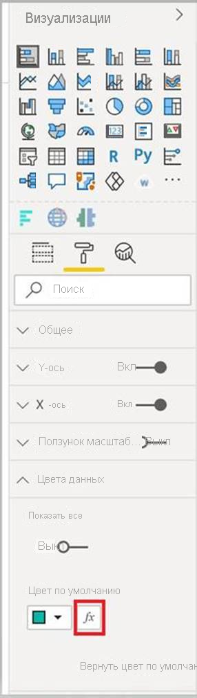

# <a name="add-conditional-formatting"></a>Условное форматирование

[Условное форматирование](../../visuals/service-tips-and-tricks-for-color-formatting.md#conditional-formatting-for-visualizations) позволяет создателю отчета указать, как в отчете отображаются цвета (в соответствии с числовым значением).

В этой статье объясняется, как добавить функцию условного форматирования в визуализацию Power BI.

Условное форматирование можно применять только к свойствам следующих типов:
* Color
* Текст
* Значок
* URL-адрес

## <a name="add-conditional-formatting-to-your-project"></a>Добавление в проект условного форматирования

В этом разделе показано, как добавить условное форматирование в существующую визуализацию Power BI. Пример кода в этой статье основан на визуальном элементе [SampleBarChart](https://github.com/microsoft/PowerBI-visuals-sampleBarChart). Исходный код можно проверить в [barChart.ts](https://github.com/microsoft/PowerBI-visuals-sampleBarChart/blob/master/src/barChart.ts).

### <a name="add-a-conditional-color-formatting-entry-in-the-format-pane"></a>Добавление записи условного форматирования цвета на панель форматирования

Из этого раздела вы узнаете, как добавить запись условного форматирования цвета в точку данных на панели форматирования.

1. Вы будете использовать массив `propertyInstanceKind` в `VisualObjectInstance`, который предоставляет `powerbi-visuals-api`. Сначала убедитесь, что файл содержит следующую операцию импорта:

    ```typescript
    import powerbiVisualsApi from "powerbi-visuals-api";
    ```

2. Указать соответствующий тип форматирования (*Constant*, *ConstantOrRule* или *Rule*) можно с помощью перечисления `VisualEnumerationInstanceKinds`. Добавьте в файл следующую операцию импорта:

    ```typescript
    import VisualEnumerationInstanceKinds = powerbiVisualsApi.VisualEnumerationInstanceKinds;
    ```

3. Перечислите все свойства, для которых нужно поддерживать условное форматирование, в массиве `propertyInstanceKind`. Определите эти свойства в методе `enumerateObjectInstances`.

    ```typescript
    public enumerateObjectInstances(options: EnumerateVisualObjectInstancesOptions): VisualObjectInstanceEnumeration {
            …
            case 'colorSelector':
                …
                    objectEnumeration.push({
                        objectName: objectName,
                        displayName: barDataPoint.category,
                        properties: {
                            fill: {
                                solid: {
                                    color: barDataPoint.color
                                }
                            }
                        },
                        selector: dataViewWildcard.createDataViewWildcardSelector(dataViewWildcard.DataViewWildcardMatchingOption.InstancesAndTotals),
                        altConstantValueSelector: barDataPoint.selectionId.getSelector(),

                        // List your conditional formatting properties
                        propertyInstanceKind: {
                            fill: VisualEnumerationInstanceKinds.ConstantOrRule
                        }
                    });
                }
            …
    }

    ```

    `VisualEnumerationInstanceKinds.ConstantOrRule` создаст запись пользовательского интерфейса условного форматирования, а также постоянный элемент пользовательского интерфейса форматирования.

    >[!div class="mx-imgBorder"]
    >

### <a name="define-how-conditional-formatting-behaves"></a>Определение поведения условного форматирования

Определите, как форматирование будет применяться к точкам данных.

С помощью функции `createDataViewWildcardSelector`, объявленной в `powerbi-visuals-utils-dataviewutils`, укажите, к чему будет применяться условное форматирование: к экземплярам, итоговым значениям или обоим объектам. Дополнительные сведения см. в разделе [DataViewWildcard](utils-dataview.md#).

В `enumerateObjectInstances` внесите следующие изменения в объекты, к которым нужно применить условное форматирование:

 * Замените значение `selector` вызовом `dataViewWildcard.createDataViewWildcardSelector(dataViewWildcardMatchingOption)`. `DataViewWildcardMatchingOption` определяет, к чему применяется условное форматирование: к экземплярам, итоговым значениям или обоим объектам.

* Добавьте свойство `altConstantValueSelector` со значением, определенным ранее для свойства `selector`.

```typescript
case 'colorSelector':
         …
            objectEnumeration.push({
                objectName: objectName,
                displayName: barDataPoint.category,
                properties: {
                    fill: {
                        solid: {
                            color: barDataPoint.color
                        }
                    }
                },

                // Define whether the conditional formatting will apply to instances, totals, or both
                selector: dataViewWildcard.createDataViewWildcardSelector(dataViewWildcard.DataViewWildcardMatchingOption.InstancesAndTotals),

                // Add this property with the value previously defined for the selector property
                altConstantValueSelector: barDataPoint.selectionId.getSelector(),

                propertyInstanceKind: { 
                    fill: VisualEnumerationInstanceKinds.ConstantOrRule
                }
            });
        }

```

## <a name="next-steps"></a>Дальнейшие действия

Ознакомьтесь со статьей [DataViewUtils](utils-dataview.md).