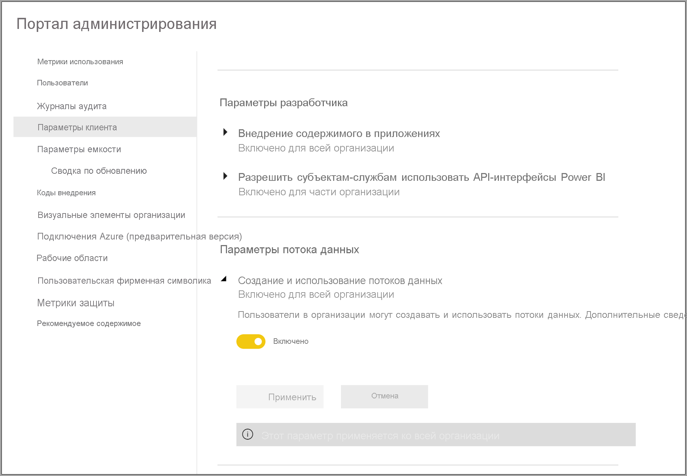

# Настройка рабочих нагрузок потока данных Power BI Premium

В подписке Power BI Premium можно создавать рабочие нагрузки потоков данных. Power BI использует концепцию *рабочих нагрузок* для описания содержимого уровня "Премиум". Рабочие нагрузки включают наборы данных, отчеты с разбивкой на страницы, потоки данных и ИИ. Рабочая нагрузка *потоков данных* позволяет использовать самостоятельную подготовку к работе с потоками данных для приема, преобразования, интеграции и обогащения данных. Управление потоками данных Power BI Premium осуществляется на **портале администрирования**.

В следующих разделах описано, как включить потоки данных в организации и настроить их параметры в емкости уровня "Премиум", а также приводятся рекомендации по распространенному использованию.

## Включение потоков данных в Power BI Premium

Для использования потоков данных в подписке Power BI Premium, в первую очередь, необходимо включить создание и использование потоков данных в организации. На **портале администрирования** выберите **Параметры клиента** и передвиньте ползунок в разделе **Параметры потока данных** в положение **Включено**, как показано на следующем рисунке.

После включения рабочей нагрузки потоков данных она настраивается с использованием параметров по умолчанию. Вы можете настроить эти параметры по своему усмотрению. Далее мы рассмотрим, где находятся эти параметры, опишем каждый из них и поможем вам понять, когда следует менять их значения, чтобы оптимизировать производительность потока данных.

## Настройка параметров потока данных

После включения потоков данных можно использовать **портал администрирования**, чтобы настроить, как создаются потоки данных и как они используют ресурсы в подписке Power BI Premium. Ниже описано, как настроить параметры потока данных.

1. На **портале администрирования** выберите **Параметры клиента**, чтобы получить список всех созданных емкостей. Выберите емкость для управления ее параметрами.

    

2. Емкость Power BI Premium отражает ресурсы, доступные для потоков данных. Вы можете изменить размер емкости, нажав кнопку **Изменить размер**, как показано на следующем рисунке.

    

3. В параметрах емкости можно настроить параметры потока данных, развернув раздел **Рабочие нагрузки**.

    

4. В разделе **Рабочие нагрузки** прокрутите до области **Потоки данных**. На следующем рисунке показаны параметры, которые можно использовать для контроля или настройки поведения рабочей нагрузки потока данных для вашей емкости.

    

В следующей таблице приведено краткое описание параметров потока данных.

| **Раздел администрирования** | **Имя параметра** | **Описание** |
|---------|---------|---------|
| **Размер емкости** | **Изменить размер** | Отображается текущая выбранная емкость с параметрами для изменения. Изменение этого параметра позволяет увеличивать или уменьшать вертикальный масштаб емкости. |
| **Рабочая нагрузка** | **Максимальный объем памяти (%)** | Максимальный процент доступной памяти, которую потоки данных могут использовать в емкости. |
| **Рабочая нагрузка** | **Улучшенная подсистема вычислений для потоков данных** | Включите этот параметр, чтобы в 20 раз быстрее рассчитывать вычисляемые сущности при работе с большими объемами данных.  **Для активации нового модуля необходимо перезапустить емкость.**  Дополнительные сведения см. в разделе [Улучшенная подсистема вычислений для потоков данных](../../admin/service-admin-premium-workloads.md#enhanced-dataflows-compute-engine). |
| **Рабочая нагрузка** | **Размер контейнера** | Максимальный размер контейнера, используемого потоками данных для каждой сущности в потоке данных. По умолчанию используется 700 МБ. Для получения дополнительных сведений см. раздел [Размер контейнера](../../admin/service-admin-premium-workloads.md#container-size). |
| **Рабочая нагрузка** | **Память подсистемы вычислений (%)** | Максимальный процент памяти, выделенный подсистеме вычислений. Значение по умолчанию — 30 %. |

В следующих разделах мы подробно рассмотрим каждый из параметров и то, как они влияют на рабочую нагрузку потока данных.

### Основные сведения о параметрах рабочей нагрузки потока данных

Чтобы лучше понять параметры рабочей нагрузки потоков данных, мы используем аналогию. *Размер емкости*, или тип экземпляра Power BI Premium, можно представить себе как *ресторан*. В ресторане есть *память рабочей нагрузки*, или *кухня*. *Подсистема вычислений* — это *духовка*. И, наконец, *контейнер* — это что-то вроде *шеф-повара*. Чтобы оценить параметры рабочей нагрузки потока данных, представьте, что готовите ужин на много персон. Соберутся важные гости, и к их приезду ужин должен быть уже готов к подаче.

Мы будем использовать эту аналогию с рестораном, чтобы объяснить каждый параметр. Мы начнем с главного уровня — емкости "Премиум", так как это первое, что вы выбираете при использовании Power BI Premium.

#### Номера SKU емкости "Премиум" — вертикальное увеличение масштаба оборудования

Рабочие нагрузки Power BI Premium используют сочетание интерфейсных и серверных ядер для обслуживания быстрых запросов по различным типам рабочей нагрузки. В статье об [узлах емкости](../../admin/service-premium-what-is.md#capacity-nodes) приводится схема, которая иллюстрирует текущие спецификации в каждом из доступных предложений рабочей нагрузки. Емкость A3 и выше может воспользоваться преимуществами подсистемы вычислений, поэтому, если вы хотите использовать расширенную подсистему вычислений, начните с [узлов емкости](../../admin/service-premium-what-is.md#capacity-nodes). 

В нашем примере с рестораном выбор емкости аналогичен выбору ресторана более высокого уровня. При более высоких затратах можно рассчитывать на более высокий уровень производительности благодаря увеличению количества интерфейсных и серверных ядер, а также объема памяти. В ресторане более высокого уровня более просторная кухня и опытные шеф-повара. Это похоже на выбор более высокого номера SKU в Power BI Premium, который позволяет повысить скорость ЦП, увеличить объем памяти на операцию и добавить дополнительный параллелизм.

#### Максимальный объем памяти — выделение емкости для потоков данных 

Параметр **Максимальный объем памяти, %**  — это процентная доля физической памяти, доступной для рабочих нагрузок потоков данных. Вы можете выделить полную емкость для рабочей нагрузки потоков данных, при этом емкость будет динамически масштабироваться по мере необходимости до установленного размера. Если вы увеличите кухню, вы сможете готовить больше блюд, а если увеличите размер рабочих нагрузок для потоков данных, у вас может быть больше потоков данных. Хотя динамическое управление ресурсами используется, параметр конфигурации *Максимальный объем памяти, %* позволяет выделить 100 % памяти для рабочей нагрузки потоков данных. Это значение удобно использовать в редких ситуациях, когда требуется обеспечить доступность памяти для рабочей нагрузки потока данных, не полагаясь на систему управления ресурсами. В нашей аналогии это выглядело бы как выделение целой кухни на приготовление одного блюда для гостя. Разумеется, это не означает, что еда получится вкуснее или приготовится быстрее, как мы узнаем в следующем разделе.

#### Размер контейнера — ошибки при обновлении или нехватке памяти

Рассмотрим параметр **Размер контейнера (МБ)** . На внутреннем уровне поток данных использует процесс, называемый *гибридными контейнерами*, для вычисления процессов ETL. Обработчик разделяет логику запроса по этим контейнерам, позволяя выполнять параллельную обработку. Увеличение количества контейнеров обеспечивает параллельную обработку и повышает производительность. Эти контейнеры ограничены сначала параметром **Емкость**, а затем параметром **Максимальный объем памяти, %** , а далее объемом памяти, выделенным для них в параметре контейнера. По умолчанию это 700 МБ. Таким образом, можно увеличить объем аппаратной памяти и размер контейнера, но это приведет к уменьшению числа параллельных операций, при этом для конкретного процесса ETL в контейнерах будет выделено больше памяти. Максимальное количество контейнеров втрое превышает число серверных ядер. Это важно, так как вы не можете выбрать очень маленький размер контейнера и увеличить количество контейнеров выше этого предела. Минимальный размер контейнера — 200 МБ. Размер контейнера также ограничен уровнем запроса, то есть каждый запрос выполняется в отдельном контейнере, за исключением случаев, когда запросы ссылаются на другие запросы. Тогда они обновляются как часть одного контейнера.

Вернемся к нашей аналогии с рестораном. Если у вас меньше поваров, но они более сосредоточены, вы сможете готовить еду гораздо быстрее, в зависимости от типа заказов и сложности блюда. Компромисс состоит в том, что поваров меньше, но ни более сосредоточены на готовке. Аналогичным образом, увеличение размера контейнера до 1200–1500 МБ может означать, что мы повысим производительность для меньшего количества более сложных заданий ETL, таких как агрегирование, объединение, сведение, операции со строками или столбцами. Мы предоставляем больше памяти для каждого контейнера, но при этом сокращаем число контейнеров. Если в нашем примере заказов будет слишком много, время их выполнения может увеличиться. Так же происходит и с размером контейнера. Увеличивайте его, когда требуется выполнить сложные операции с сущностями, и производительность вам важнее, чем параллелизм, так как при этом количество контейнеров уменьшится.

По сути, размер контейнера необходимо оптимизировать в зависимости от запросов. Например, если вы просто загружаете данные из источника в сущность, вам не нужно извлекать данные и выполнять с ним операции. В этом случае вам требуется максимальный параллелизм, так как необходимо увеличить скорость операций загрузки и обновления. И наоборот, при добавлении дополнительных операций преобразования — сложных фильтров, объединений и агрегирования — потребуется гораздо больше памяти. Имейте в виду, что при наличии других операций потока данных, выполняющихся в емкости, операции могут выполняться медленно и ожидать в очереди. В этом контексте можно использовать приложение **Power BI Premium Capacity Metrics** для мониторинга и управления потоками данных, производительностью обновления и емкостью в целом. Вы можете использовать приложение [Power BI Premium Capacity Metrics](../../admin/service-premium-capacity-optimize.md#what-content-is-using-up-my-capacity) для фильтрации по емкости и просмотра метрик производительности для содержимого рабочей области. Вы можете просматривать метрики производительности и использования ресурсов по часам за последние семь дней для всего содержимого, хранящегося в емкости Premium, поэтому рекомендуем начать изучение производительности потоков данных с этого приложения.

#### Расширенная подсистема вычислений — это возможность повысить производительность

В нашей аналогии [расширенная подсистема вычислений](dataflows-premium-features.md#the-enhanced-compute-engine) похожа на духовку. Power BI использует подсистему вычислений для обработки запросов и операций обновления. Расширенная подсистема вычислений лучше стандартной. Она загружает данные в кэш SQL, использует SQL для ускорения преобразования сущностей и операций обновления и включает подключения DirectQuery. Улучшенная духовка помогает готовить быстрее и эффективнее. Если ваша бизнес-логика это позволяет, установите для вычисляемых сущностей значение **Вкл.** или **Оптимизировано**, и Power BI использует SQL для ускорения производительности. Если установить значение **Вкл.** для подсистемы, вы получите подключение DirectQuery. В нашей аналогии некоторым блюдам не требуется духовка. Это относится и к расширенной подсистеме вычислений — убедитесь, что поток данных использует ее правильно.

> [!NOTE]
> Расширенная подсистема вычислений пока доступна не во всех регионах.

## Руководство по распространенным сценариям

В этом разделе приводятся рекомендации по распространенным сценариям использования рабочих нагрузок потоков данных с Power BI Premium.

### Медленные обновления

Медленные обновления обычно связаны с проблемами параллелизма. Необходимо проверить следующие параметры по порядку:

1. Скорость обновлений зависит от характера подготовки данных. Если сравнить это с рестораном, представьте, что вы заранее подготовили продукты. В этом сценарии еду можно приготовить гораздо быстрее. Аналогичным образом, если вы можете оптимизировать время обновления, используя подготовку и предварительную логику запросов в источнике данных, сделайте это. В частности, при использовании реляционной базы данных, такой как SQL, в качестве источника, проверьте, может ли исходный запрос выполняться в источнике, и используйте этот запрос источника для начального извлечения потока данных. Если вы не можете использовать собственный запрос в исходной системе, выполните операции, которые [подсистема потоков данных может выполнять в источнике](/power-query/power-query-folding).

2. Оцените распределение времени обновления в той же емкости. Операции обновления — это процесс, требующий значительных вычислений. В аналогии с рестораном распределение времени обновления аналогично ограничению числа гостей. Так же, как рестораны планируют наполняемость, вам следует обдумать, как выполнять операции обновления вне периодов максимальной нагрузки. Это значительно поможет уменьшить нагрузку на емкость.

3. Увеличьте общий объем памяти, занимаемой рабочей нагрузкой. Подумайте о размере кухни. Настройка этого ресурса аналогична подбору числа поваров на кухне. Для этого настройте параметр **Максимальный объем памяти, %** , который можно увеличить до 100 %.

4. Уменьшите объем памяти в контейнере, чтобы у вас было больше контейнеров. Допустим, вместо того, чтобы нанять знаменитого шеф-повара, такого как Гордон Рамси, вы нанимаете множество компетентных, но не таких дорогих поваров. На кухне больше поваров, но они выполняют небольшие задачи. Точно так же у вас может быть больше контейнеров, но в каждом из них будет меньше памяти.

5. Выполните оба описанных выше действия, дополнительно увеличив степень параллелизма, так как у вас будет более просторная кухня и больше поваров.
    
6. Если действия, описанные в этом разделе, не обеспечивают требуемую степень параллелизма, возможно, следует выбрать для емкости более высокий номер SKU. Затем еще раз выполните действия, описанные выше в этом разделе.

### Исключения, связанные с нехваткой памяти

Если у вас возникают **исключения, связанные с нехваткой памяти**, необходимо повысить производительность контейнеров и памяти. Выполните следующие действия.

1. Увеличьте объем памяти в контейнере. Это похоже на выбор одного знаменитого шеф-повара вместо нескольких обычных.

2. Увеличьте объем памяти для рабочей нагрузки и для контейнера. В нашей аналогии вы получите более просторную кухню и более квалифицированных поваров.

3. Если эти изменения не дают вам желаемой степени параллелизма, рассмотрите возможность повышения номера SKU для Power BI Premium.

### Использование подсистемы вычислений для повышения производительности

Выполните следующие действия, чтобы разрешить рабочим нагрузкам использовать подсистему вычислений, и всегда улучшайте производительность:

**Для вычисляемых и связанных сущностей в одной рабочей области:**

1. Для *приема* сосредоточьтесь на том, чтобы получить данные в хранилище как можно быстрее, используя фильтры только в том случае, если они уменьшают общий размер набора данных. Рекомендуется выполнять логику преобразования отдельно от этого шага и позволить подсистеме сосредоточиться на первоначальном сборе ингредиентов. Затем выполните преобразование и бизнес-логику в отдельном потоке данных в той же рабочей области, используя связанные или вычисляемые сущности. Это позволит подсистеме активироваться и ускорить вычисления. В нашей аналогии это похоже на подготовку еды на кухне: обычно этот этап выполняется отдельно от сбора сырых ингредиентов и до помещения продуктов в духовку. Аналогичным образом необходимо подготовить логику отдельно, прежде чем она сможет воспользоваться преимуществами подсистемы вычислений.

2. Убедитесь, что выполняете операции, которые могут свертываться, например слияние, объединение, преобразование и [другие](/power-query/power-query-folding#transformations-that-can-achieve-folding).

3. Создание потоков данных [в рамках опубликованных рекомендаций и ограничений](dataflows-features-limitations.md#dataflows-in-premium).

Вы также можете использовать DirectQuery.

### Подсистема вычислений включена, но производительность низкая

Выполните следующие действия, если подсистема вычислений включена, но при этом наблюдается низкая производительность:

1. Ограничьте вычисляемые и связанные сущности, которые существуют в разных рабочих областях.

2. Если сначала вы выполняете обновление с включенной подсистемой вычислений, данные записываются в озеро и кэш. Двойная запись замедляет обновления.

3. Если у вас есть поток данных, связанный с несколькими потоками данных, запланируйте обновление исходных потоков данных, чтобы они не обновлялись одновременно.

## Дальнейшие действия
Дополнительные сведения о потоках данных и Power BI вы можете получить в следующих статьях.

* [Вводные сведения о потоках данных и самостоятельной подготовке данных](dataflows-introduction-self-service.md)
* [Создание потока данных](dataflows-create.md)
* [Настройка и использование потока данных](dataflows-configure-consume.md)
* [Настройка хранилища потоков данных для использования Azure Data Lake 2-го поколения](dataflows-azure-data-lake-storage-integration.md)
* [ИИ с потоками данных](dataflows-machine-learning-integration.md)
* [Рекомендации и ограничения, касающиеся потоков данных](dataflows-features-limitations.md)