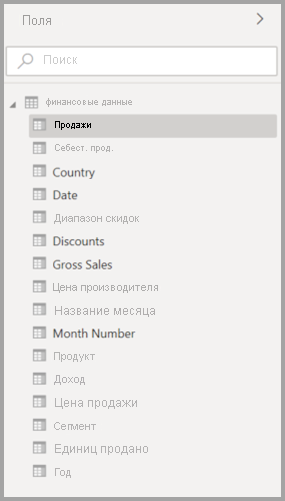
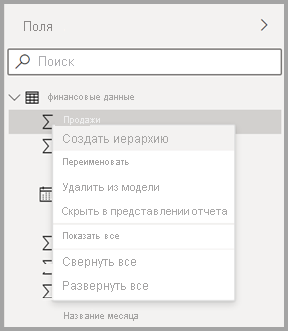
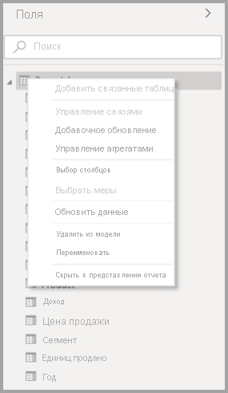
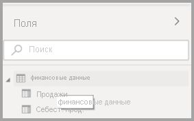

# Использование списка полей в Power BI Desktop (предварительная версия)

Начиная с обновления за ноябрь 2020 года мы будем объединять списки **полей** в представлении модели, представлении данных и представлении отчета в Power BI Desktop. Унификация этих представлений приведет к согласованности функциональности и пользовательского интерфейса в представлениях. Кроме того, об этом просили клиенты.

В представлениях вы заметите следующие изменения:

* Значки
* Функционал поиска
* Элементы контекстного меню
* Аналогичное поведение перетаскивания
* Подсказки
* Улучшение специальных возможностей

Цель — повысить удобство использования Power BI Desktop. Изменения должны оказать минимальное влияние на обычный рабочий процесс с данными.

## Включение нового списка полей (предварительная версия)

Объединенный список полей начинается с представления **модели**, а затем будет включен для других представлений. Чтобы включить объединенное представление полей в Power BI Desktop, перейдите в раздел **Файл > Параметры** и выберите **Предварительная версия функций** в области слева. В разделе предварительной версии функций установите флажок рядом с пунктом **Новый список полей**.

Чтобы изменения вступили в силу, необходимо перезапустить Power BI Desktop.

## Изменения списка полей

Обновления в списке полей показаны в следующих таблицах. 

|**Исходный список полей (представление модели)**  | **Новый список полей (представление модели)**  |
|:---------:|:---------:|
|**Исходное значение** |**Создать** |
|**Значки и пользовательский интерфейс**       ||
|     |    |
|**Контекстное меню — Поле**       ||
|     |    |
|**Контекстное меню — Таблица**       ||
|     |    |
|**Подсказки**       ||
|     |    |

## Значки списка полей

Кроме того, представлены новые значки списка полей. В следующей таблице показаны исходные значки и их новые эквиваленты, а также приводится краткое описание каждого из них. 

|Исходный значок  |Новый значок  |Описание  |
|:---------:|:---------:|:---------|
|     |           |Папка в списке "Поля"         |
|     |         |Числовое поле. Числовые поля — это статистические выражения, которые можно, например, суммировать или усреднять. Статистические выражения импортируются вместе с данными и определяются в модели данных, на которой основан отчет. Дополнительные сведения см. в разделе [Статистические выражения в отчетах Power BI](../create-reports/service-aggregates.md).         |
|     |         |Вычисляемый столбец с данными нечислового типа. Новые нечисловой столбец, создаваемый с помощью формулы на языке DAX, которая определяет значения столбца. Дополнительные сведения о [вычисляемых столбцах](desktop-calculated-columns.md).        |
|     |          |Числовой вычисляемый столбец. Новый столбец, создаваемый с помощью формулы на языке DAX, которая определяет значения столбца. Дополнительные сведения о [вычисляемых столбцах](desktop-calculated-columns.md).         |
|     |          |Мера. Мера имеет собственную жестко заданную формулу. Читатели отчета не могут изменить это вычисление: например, если это сумма, то нельзя получить ничего, кроме суммы. Значения не хранятся в столбце. Они рассчитываются оперативно, в зависимости от своего расположения в визуальном элементе. Дополнительные сведения см. в разделе [Основные сведения о мерах](desktop-measures.md).         |
|     |         |Группа мер.         |
|     |         |КПЭ. Наглядный индикатор, который позволяет оценить достижение определенной измеримой цели. Дополнительные сведения о визуальных элементах [ключевого показателя эффективности (КПЭ)](../visuals/power-bi-visualization-kpi.md).         |
|     |           |Иерархия полей. Чтобы увидеть поля, из которых состоит иерархия, щелкните стрелку. Просмотрите на YouTube это видео по Power BI о [создании иерархий и работе с ними](https://www.youtube.com/watch?v=q8WDUAiTGeU) для получения дополнительных сведений.         |
|     |         |Геоданные. Эти поля расположения можно использовать для создания визуализаций карты.         |
|     |          |Поле удостоверения. Поля с этим значком являются уникальными и настроены для отображения всех значений, даже если они имеют дубликаты. Например, в ваших данных могут присутствовать записи для двух разных людей с именем "Николай Новиков", при этом каждая из них будет считаться уникальной. Суммироваться они не будут.         |
|     |          |Параметр. Задайте параметры, чтобы части ваших отчетов и моделей данных (такие как фильтр запроса, ссылка на источник данных, определение меры и т. п.) зависели от одного или нескольких значений параметров. Дополнительные сведения см. в записи блога Power BI о [параметрах запроса](https://powerbi.microsoft.com/blog/deep-dive-into-query-parameters-and-power-bi-templates/).         |
|     |         |Поле календарной даты со встроенной таблицей дат.         |
|     |          |Вычисляемая таблица: таблица, созданная с помощью формулы выражения анализа данных (DAX) на основе данных, уже загруженных в модель. Их лучше использовать для промежуточных вычислений, которые необходимо сохранить как часть модели.         |
|     |         |Предупреждение. Вычисляемое поле с ошибкой. Например, синтаксис выражения DAX может быть неверным.         |
|     |         |Группа: Значения в этом столбце основаны на группировании значений из другого столбца с помощью функции групп и ячеек. Узнайте больше о том, как [использовать группирование и разделение на ячейки](../create-reports/desktop-grouping-and-binning.md).         |
| нет исходного значка    |          |Мера обнаружения изменений: при настройке страницы для автоматического обновления можно настроить [меру обнаружения изменений](../create-reports/desktop-grouping-and-binning.md), которая запрашивается, чтобы определить, нужно ли обновлять остальные визуальные элементы страницы.         |

## Дальнейшие действия

Рекомендуем также ознакомиться со следующими материалами:

* [Создание вычисляемых столбцов в Power BI Desktop](desktop-calculated-columns.md)
* [Группирование данных и разделение их на ячейки в Power BI Desktop](../create-reports/desktop-grouping-and-binning.md)
* [Использование линий сетки и привязки к сетке в отчетах Power BI Desktop](../create-reports/desktop-gridlines-snap-to-grid.md)

