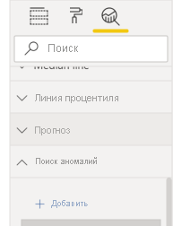

# Обнаружение аномалий (предварительная версия)

[!INCLUDE[consumer-appliesto-nyyn](../includes/consumer-appliesto-nyyn.md)]    

Обнаружение аномалий позволяет улучшить графики путем автоматического выявления аномалий в данных временных рядов. Оно также предоставляет объяснение аномалий для анализа основных причин.  С помощью всего нескольких щелчков мыши можно легко находить аналитические сведения без тщательной обработки данных. Аномалии можно создавать и просматривать как в Power BI Desktop, так и в службе Power BI. Шаги и иллюстрации в этой статье относятся к Power BI Desktop.

Так как эта функция находится на этапе предварительной версии, сначала необходимо включить параметр функции. Перейдите в раздел **Файл** > **Настройки и параметры** > **Параметры** > **Предварительные версии функций** и убедитесь, что **Обнаружение аномалий** включено:

:::image type="content" source="media/power-bi-visualization-anomaly-detection//preview-feature-switch.png" alt-text="Снимок экрана: включение предварительной версии функции &quot;Обнаружение аномалий&quot;.":::
 
## Начало работы
В этом учебнике используются данные о продажах через Интернет различных товаров. Для работы с этим руководством скачайте [пример файла](https://github.com/microsoft/powerbi-desktop-samples/blob/master/Monthly%20Desktop%20Blog%20Samples/2020/2020SU09%20Blog%20Demo%20-%20September.pbix) сценария продаж через Интернет.

Обнаружение аномалий можно включить, нажав на диаграмму и добавив параметр "Найти аномалии" на панели аналитики. 

 

 Например, на этой диаграмме показан доход за определенный период. Автоматическое обнаружение аномалий добавляет к диаграмме аномалии и ожидаемый диапазон значений. Если значение выходит за пределы ожидаемых границ, оно отмечается как аномалия. Дополнительные сведения об алгоритме Детектора аномалий см. в этой [записи блога](https://techcommunity.microsoft.com/t5/ai-customer-engineering-team/overview-of-sr-cnn-algorithm-in-azure-anomaly-detector/ba-p/982798).

 
 
## Форматирование аномалий

Этот интерфейс легко настроить. Можно отформатировать форму, размер и цвет аномалии, а также цвет, стиль и прозрачность ожидаемого диапазона. Также можно настроить параметр алгоритма.  При увеличении чувствительности алгоритм более чувствителен к изменениям в данных. В этом случае даже небольшое отклонение помечается как аномалия. При снижении чувствительности алгоритм использует более избирательный подход к аномалиям.

 
 
## Объяснения
Аномалии можно не только обнаруживать, но и автоматически объяснять. При выборе аномалии Power BI выполняет анализ по полям в модели данных, чтобы найти возможные объяснения. Он дает объяснение на естественном языке для аномалии и факторов, связанных с этой аномалией, с сортировкой по надежности объяснения. Здесь видно, что 30 августа доход был 5187 USD, что превышает ожидаемый диапазон от 2447 до 3423. Я могу открыть карточки на этой панели, чтобы просмотреть дополнительные сведения.

 
### Настройка объяснений
Вы также можете управлять полями, используемыми для анализа. Например, если вы перетащите продавца и город в поле **Объяснение**, Power BI будет проводить анализ только на основе этих полей. В этом случае аномалия 31 августа, кажется, связана с конкретным продавцом и конкретными городами. Здесь продавец Fabrikam имеет надежность 99 %. Power BI вычисляет *надежность* как отношение отклонений от ожидаемого значения при фильтрации по измерению относительно отклонения в общем значении. Например, это отношение разницы между фактическим и ожидаемым значениями между временными рядами компонента *Fabrikam* и агрегированными временными рядами *общего дохода* для точки аномалии. При открытии этой карточки отображается визуальный элемент с пиком дохода для этого продавца 31 августа. Используйте параметр **Добавить в отчет**, чтобы добавить этот визуальный элемент на страницу.

## Ограничения
- Обнаружение аномалий поддерживается только для визуальных элементов графика, содержащих данные временных рядов в поле оси.
- Обнаружение аномалий не поддерживается с условными обозначениями, несколькими значениями или вторичными значениями на графике.
- Для обнаружения аномалий требуется как минимум 12 точек данных.
- Обнаружение аномалий не предназначено для строк прогноза, минимального, максимального, среднего и медианного значения или процентиля.
- Прямой запрос к источнику данных SAP, сервер отчетов Power BI, динамическое подключение к Azure Analysis Services и SQL Server Analysis Services не поддерживаются.
- Объяснения аномалий не работают с параметрами "Отобразить значение как".
- Детализация перехода к следующему уровню в иерархии не поддерживается.
