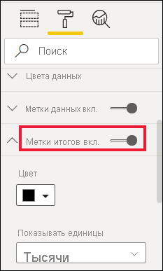

# Настройка заголовков визуализаций, фона, меток и условных обозначений

[!INCLUDE[consumer-appliesto-nyyn](../includes/consumer-appliesto-nyyn.md)]

В этом руководстве описано несколько способов настройки визуализации. Существует так много вариантов настройки визуализации. Лучший способ изучить их всех — ознакомиться с областью **форматирования** (выберите значок валика). Из этой статьи вы узнаете, как приступить к работе и настроить заголовок визуализации, условные обозначения, фон, метку, слой, а также добавить тему.

Не удается настроить все визуализации. Чтобы узнать больше сведений о визуализации, см. [полный список](#visualization-types-that-you-can-customize).

## Предварительные требования

- Служба Power BI или Power BI Desktop

- Пример отчета "Анализ розничной торговли"

> [!NOTE]
> Для предоставления общего доступа к отчету Power BI и вам, и коллеге необходимо иметь отдельные лицензии Power BI Pro или сохранить отчет в емкости Премиум. См. статью [Фильтрация и совместное использование отчета Power BI](../collaborate-share/service-share-reports.md).

## Настройка заголовка визуализации в отчете

Чтобы продолжить, войдите в Power BI Desktop и откройте отчет [Анализ розничной торговли](../create-reports/sample-datasets.md).

> [!NOTE]
> При закреплении визуализации на информационной панели она становится плиткой. Для самих плиток можно также настроить [подпись, подзаголовок, гиперссылку, а также изменить ее размер](../create-reports/service-dashboard-edit-tile.md).

1. Перейдите на страницу **Новые магазины** примера отчета **Анализ розничной торговли**.

1. Выберите гистограмму с группировкой **Количество открытых магазинов по месяцу открытия и сетям магазинов**.

1. В области **визуализации** выберите значок валика для отображения параметров форматирования.

1. Выберите **Заголовок**, чтобы развернуть этот раздел.

   

1. Переместите ползунок **Заголовок** в положение **Вкл.** .

1. Измените текст заголовка, введя *Количество магазинов по месяцам открытия* в поле **Текст заголовка**.

    

1. Измените **цвет шрифта** на белый, а **цвет фона** — на синий.

    а. Щелкните раскрывающийся список и выберите цвет в одном из разделов: **Цвета темы**, **Последние цвета**, **Дополнительный цвет**.

    

    б. Щелкните раскрывающийся список, чтобы закрыть окно цвета.

1. Увеличьте размер шрифта до **16 пт**.

1. Последняя настройка, которую вы выполните с заголовком диаграммы, — выровняете его по центру визуализации.

    

    Сейчас заголовок вашей гистограммы с группировкой будет выглядеть примерно так:

    

Сохраните внесенные изменения и перейдите к следующему разделу.

Если вы захотите отменить все изменения, нажмите кнопку **Вернуть значения по умолчанию** в нижней части панели настройки **заголовка**.

## Настройка цвета фона визуализации

Для этой же гистограммы с группировкой разверните параметры **фона**.

1. Переместите ползунок **фона** в положение **Вкл.** .

1. Выберите серый цвет в раскрывающемся списке.

1. Измените **прозрачность** до **74 %** .

Сейчас фон вашей гистограммы с группировкой будет выглядеть примерно так:

Сохраните внесенные изменения и перейдите к следующему разделу.

Если вы захотите отменить все изменения, нажмите кнопку **Вернуть значения по умолчанию** в нижней части панели настройки **фона**.

## Настройка условных обозначений визуализации

1. Откройте страницу отчета **Обзор** и выберите диаграмму **Разница в общем объеме продаж по FiscalMonth и региональным менеджерам**.

1. Откройте панель **форматирования**, щелкнув значок валика.

1. Разверните параметры **условных обозначений**:

    

1. Переместите ползунок **условных обозначений** в положение **Вкл.** .

1. Расположение условные обозначения слева от визуализации.

1. Добавьте заголовок условных обозначений путем переключения **заголовка** в положение **Вкл.** .

1. В поле **Имя условных обозначений** введите *Руководитель*.

1. Измените **цвет** на черный.

Сохраните внесенные изменения и перейдите к следующему разделу.

Если вы захотите отменить все изменения, нажмите кнопку **Вернуть значения по умолчанию** в нижней части панели настройки **условных обозначений**.

## Настройка меток итогов для визуальных элементов с накоплением

В визуальных элементах с накоплением могут отображаться метки данных и метки итогов. На гистограмме с накоплением метки данных указывают значение для каждой части столбца. Метки итогов указывают суммарное значение для всего агрегированного столбца. 

Просмотрите видео Риена о добавлении меток итогов на диаграмму с накоплением, а затем выполните следующие действия, чтобы попробовать сделать это самостоятельно.

> [!VIDEO https://www.youtube.com/embed/OgjX-pFGgfM]

1. Откройте страницу отчета **Обзор** и выберите линейчатую диаграмму **Average selling area size by chain and store type** (Средняя площадь торгового зала по сетям и типам магазинов).

1. На вкладке **Визуализация** выберите , чтобы преобразовать эту линейчатую диаграмму в линейчатую диаграмму с накоплением. Обратите внимание, что метки данных сохраняются на визуальном элементе.

    

1. Откройте панель **форматирования**, щелкнув значок валика.

1. Переместите ползунок **Total labels** (Метки итогов) в положение **Вкл**. 

    

1. При необходимости метки итогом можно отформатировать. В этом примере мы изменили цвет на черный, увеличили размер шрифта и выбрали отображение значений в **тысячах**.

    

## Настройка порядка слоев

Вы можете изменить порядок слоев для визуальных элементов и фигур в отчетах. Порядок слоев определяет, какие объекты будут отображаться на переднем плане после их выбора. Выбранный объект на холсте отчета становится активным и перемещается на верхний слой. В случае использования визуальных элементов это поведение упрощает взаимодействие с выбранным визуальным элементом. Но для работы с фигурами и фонами может потребоваться обеспечить их защиту на нижнем слое, чтобы исключить их случайный выбор и перекрытие визуальных элементов отчета. 

Элементы управления порядком слоев доступны в службе Power BI, Power BI Desktop, Power BI Mobile и на сервере отчетов. В этой статье содержатся сведения об изменении поведения порядка слоев в службе Power BI.

Просмотрите видео Риена об изменении поведения порядка слоев, а затем выполните следующие действия, чтобы попробовать сделать это самостоятельно.

> [!VIDEO https://www.microsoft.com/videoplayer/embed/RE4IY3L]

1. Добавьте новую страницу отчета, выбрав желтый значок "плюс".

1. Добавьте фигуру на холст. Здесь мы добавили синий прямоугольник.

    

1. Скопируйте и вставьте визуальный элемент с другой страницы отчета.

    

    Теперь, когда у вас есть 2 слоя, попробуйте выбрать круговую диаграмму, а затем фон. При выборе круговой диаграммы Power BI делает этот объект активным и отображает его меню заголовка. При выборе прямоугольника Power BI делает этот объект активным и выводит его на верхний слой, где он закрывает собой круговую диаграмму. Это поведение по умолчанию можно изменить.

1. Выберите прямоугольник и откройте панель форматирования. Разверните раздел **Общие** и найдите переключатель **Maintain layer order** (Сохранить порядок слоев). Сохраните изменения отчета и переключитесь в режим чтения.

    

1. Синий прямоугольник, выбранный в режиме чтения, останется на нижнем слое.

## Настройка цветов с помощью темы

С помощью тем отчета можно применить изменения макета ко всему отчету, например использовать корпоративные цвета, изменить наборы значков или применить новое визуальное форматирование по умолчанию. При применении темы отчета для всех визуальных элементов в отчете используются цвета и форматирование из выбранной темы.

Чтобы применить тему к отчету, в строке меню выберите команду **Переключить тему**. Выберите тему.  В приведенном ниже отчете используется тема **Солнечная**.

## Типы визуализации, которые вы можете настроить

Ниже приведены список визуализаций и параметры настроек, доступных для каждого пользователя:

| Визуализация | Название | Фон | Условные обозначения | Метки итогов
|:--- |:--- |:--- |:--- |:--- |
| С областями | да | да |да | да  |
| Линейчатая | да | да |да | да |
| Карточка | да | да |Н/Д | Н/Д |
| Многострочная карточка | да | да | Н/Д | Н/Д |
| Столбец | да | да | да |  да |
| Комбинированная | да | да | да | да |
| кольцевой график; | да | да | да | Н/Д |
| Картограмма | да | да | да |Н/Д |
| Воронкообразная диаграмма | да | да | Н/Д |Н/Д |
| Индикаторная диаграмма | да | да | Н/Д |Недоступно |
| Ключевой фактор влияния | да | да | Н/Д |Н/Д |
| КПЭ | да | да | Н/Д |Н/Д |
| Линия | да | да | да |Н/Д |
| Карта | да | да | да |Н/Д |
| Матрица | да | да | Недоступно |да |
| Круговая | да | да | да |Недоступно |
| Вопросы и ответы | да | да | Н/Д |Н/Д |
| Точечная диаграмма | да | да | да |Н/Д |
| Фигура | да | да | да |Н/Д |
| Срез | да | да | Н/Д |Н/Д |
| Таблица | да | да | Недоступно |да |
| Текстовое поле | нет | да | Н/Д |Н/Д |
| Диаграмма-дерево | да | да | да |Н/Д |
| Каскадная диаграмма | да | да | да |н/д |

## Дальнейшие действия

- [Настройка свойств осей X и Y](power-bi-visualization-customize-x-axis-and-y-axis.md)

- [Начало работы с форматированием цветом и свойствами осей](service-getting-started-with-color-formatting-and-axis-properties.md)

Появились дополнительные вопросы? [Ответы на них см. в сообществе Power BI.](https://community.powerbi.com/)
